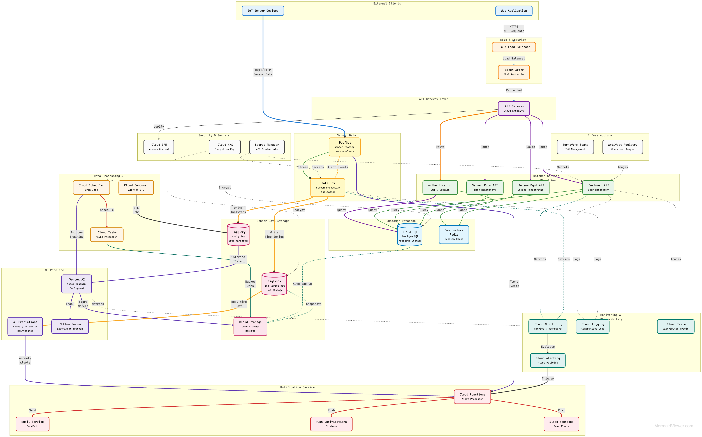

# GreenCop

Server room monitoring with IoT sensors.



Multi-tenant platform for managing server rooms and IoT sensors. Customers can register rooms, deploy sensors, and monitor environmental data. Built with FastAPI backend, React frontend, and Go CLI for sensor management.

## TODO

- ML service for anomaly detection
- Kafka streaming for real-time data
- GCP deployment with monitoring
- Alert notifications

## Run

Backend:

```bash
cd services/customers
docker-compose up
```

Frontend:

```bash
cd web
npm install && npm run dev
```

Sensors:

```bash
cd services/sensors
go build -o sensors
./sensors register --config-file cmd/config.yaml
```

## API

```
POST   /api/v1/customers/register
POST   /api/v1/customers/login
GET    /api/v1/customers/info/{id}

POST   /api/v1/server_rooms/new_room
GET    /api/v1/server_rooms/{room_id}
PUT    /api/v1/server_rooms/{room_id}
DELETE /api/v1/server_rooms/{room_id}

POST   /api/v1/sensors/new_sensor
GET    /api/v1/sensors/sensor/{sensor_id}
GET    /api/v1/sensors/list_sensors/{room_id}
PUT    /api/v1/sensors/update_sensor/{sensor_id}
DELETE /api/v1/sensors/delete_sensor/{sensor_id}

GET    /health
```
