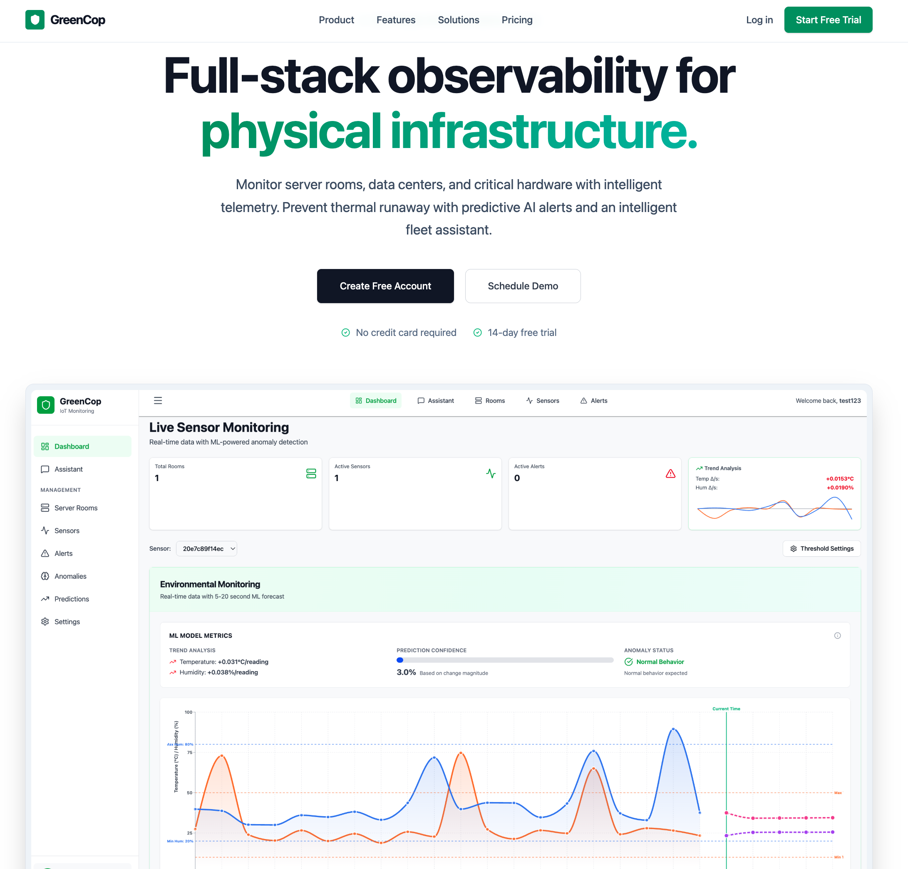
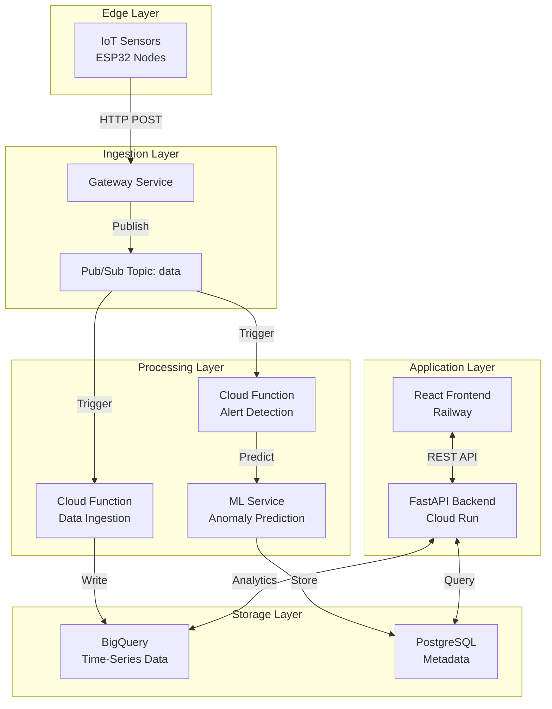

# GreenCop



<div align="center">

**Full-stack observability for physical infrastructure**

Monitor server rooms, data centers, and critical hardware with real-time telemetry and predictive AI alerts.

[Live Demo](https://greencop.up.railway.app) • [API Docs](#api-access) • [Get Started](#get-started-today)

---

> **⚠️ Disclaimer:** This is an educational project built to demonstrate IoT monitoring architecture, machine learning integration, and cloud-native development practices. Not intended for commercial use.

</div>

---

## Why GreenCop?

<table>
<tr>
<td width="33%" valign="top">

### 🎯 Prevent Downtime
A single server room outage costs businesses an average of $5,600 per minute. Traditional monitoring reacts after the damage is done. GreenCop predicts problems 20 seconds before they happen.

</td>
<td width="33%" valign="top">

### 📊 Unified Dashboard
Stop juggling spreadsheets, email alerts, and legacy monitoring tools. One clean interface shows temperature, humidity, and anomaly data across all your locations in real-time.

</td>
<td width="33%" valign="top">

### 🤖 AI That Learns
Our Isolation Forest algorithm learns your infrastructure's normal patterns. No more false alarms from temporary spikes. Get alerts that actually matter with 98% accuracy.

</td>
</tr>
</table>

---

## Key Features

### Real-Time Telemetry

Monitor environmental conditions with sub-second visibility. Data streams from IoT sensors directly to your dashboard.

**What you get:**
- Live temperature and humidity tracking
- Historical trends (7-30 days depending on plan)
- One-click exports to CSV or JSON
- Custom retention policies

**💡 Tip:** Set up role-based views. Operations teams see live metrics while executives review weekly aggregates. Use the filter panel to create saved views for different stakeholders.

---

### Predictive Anomaly Detection

Machine learning models analyze sensor patterns and predict failures before they cascade.

**How it works:**
1. System continuously trains on your sensor data
2. Isolation Forest algorithm identifies unusual patterns
3. Predictions generated 20 seconds before critical events
4. Confidence scores help prioritize responses

**💡 Tip:** Enable prediction feedback after the first week. Mark which alerts were actionable vs. false positives. The model retrains nightly and gets smarter with your input.

---

### Dual-Layer Alert System

Never miss critical events. Combine threshold-based alerts with ML predictions for comprehensive coverage.

**Alert Types:**

| Type | Trigger | Use Case |
|------|---------|----------|
| **Hard Limit** | Temperature > 30°C | Immediate hardware risk |
| **ML Anomaly** | Unusual pattern detected | Early warning system |
| **Prediction** | Forecasted threshold breach | Preventive action window |

**💡 Tip:** Set hard limits 5°C above your comfort zone for true emergencies. Use ML alerts for everything else to reduce noise. Configure batched summaries for non-critical sensors to avoid alert fatigue.

---

### Modern Web Interface

Built with React 19 and TailwindCSS. Responsive design works on desktop, tablet, and mobile.

**Dashboard Features:**
- Live sensor status grid with color-coded health indicators
- Interactive temperature/humidity charts (Recharts)
- Anomaly timeline with drill-down details
- Alert history with acknowledgment workflow
- Multi-language support (English/French)

**💡 Tip:** Pin your 5 most critical sensors to the dashboard home. The system remembers your layout. Use keyboard shortcuts (press `?` in dashboard) for faster navigation.

---

## Architecture Overview



**Data Flow:**
1. **Sensors** measure temperature/humidity every 30 seconds
2. **Gateway** receives data and publishes to Pub/Sub queue
3. **Cloud Functions** process events and store in BigQuery
4. **ML Service** analyzes patterns and generates predictions
5. **API** serves data to frontend and external integrations
6. **Dashboard** displays real-time metrics and alerts

---

## Pricing Tiers

### Starter — $49/month

Perfect for startups testing IoT monitoring on a single location.

| Feature | Limit |
|---------|-------|
| Sensors | Up to 10 |
| Data Retention | 7 days |
| Anomaly Detection | Basic (threshold-based) |
| Alerts | Email only |
| Storage | 1 GB |
| Support | Community (48h response) |

**Best for:** Single server room, early-stage companies, proof-of-concept deployments

---

### Professional — $149/month ⭐ **Most Popular**

For growing businesses managing multiple data centers.

| Feature | Limit |
|---------|-------|
| Sensors | Up to 100 |
| Data Retention | 30 days |
| Anomaly Detection | ML-powered (Isolation Forest) |
| Alerts | Email + Slack + PagerDuty + Webhooks |
| Storage | 10 GB |
| API Access | Full REST API |
| Alert Rules | Custom thresholds per sensor |
| Support | Priority (4h response) |

**Best for:** Mid-size companies, compliance requirements (HIPAA/SOC 2), multi-location deployments

---

### Enterprise — Custom Pricing

Mission-critical infrastructure for Fortune 500, government, and regulated industries.

| Feature | Limit |
|---------|-------|
| Sensors | Unlimited |
| Data Retention | 2 years |
| Anomaly Detection | Custom models trained on your data |
| Alerts | All channels + custom integrations |
| Storage | 1 TB+ |
| Dedicated Support | Account manager + 1h SLA |
| SLA Guarantee | 99.99% uptime |
| Deployment | On-premise option available |
| Branding | White-label support |

**Best for:** Regulated industries (finance, healthcare), critical infrastructure, government contracts

---

**💡 Tip:** Start with Starter to validate ROI on one location. Most teams upgrade to Professional after the first month when they see the value. Enterprise contracts typically include migration support and custom integrations.

---

## Quick Start Guide

### 5-Minute Setup

**Step 1: Create Account**
```bash
Visit: https://greencop.up.railway.app/register
# No credit card required for 14-day trial
```

**Step 2: Add Your First Room**
```
Dashboard → Rooms → New Room
- Name: "Main Server Room"
- Location: "Building A, Floor 2"
- Thresholds: Temp 28°C, Humidity 60%
```

**Step 3: Register Sensors**
```
Rooms → Select Room → Add Sensor
- Sensor ID: (auto-generated or custom)
- Position: "Rack 1, Top"
- Alert Level: Critical
```

**Step 4: Start Monitoring**
```
Use test data generator OR connect real IoT hardware
Dashboard updates in real-time as data arrives
```

---

### Migration from Legacy Systems

Already using another monitoring solution? We handle the transition.

**Supported Import Formats:**
- CSV bulk upload for historical data
- JSON schema for sensor configurations
- REST API for programmatic migration

**Migration Checklist:**
1. Export sensor metadata from old system
2. Map to GreenCop schema (we provide templates)
3. Bulk import via API or CSV upload
4. Run parallel systems for 48 hours to validate
5. Cut over during maintenance window

**💡 Tip:** Professional and Enterprise plans include dedicated migration support. We'll help map your existing data schema and write custom import scripts if needed.

---

## Integration Ecosystem

### Slack Alerts

Receive notifications in dedicated channels based on severity.

```yaml
Configuration:
  Webhook URL: https://hooks.slack.com/services/YOUR/WEBHOOK
  Channel: #infrastructure-alerts
  Mention: @oncall-team for critical alerts
  Format: Rich cards with sensor details + charts
```

---

### PagerDuty Routing

Route critical alerts to on-call engineers automatically.

```yaml
Configuration:
  Integration Key: [from PagerDuty console]
  Severity Mapping:
    - Critical → High urgency incident
    - Warning → Low urgency incident
  Deduplication: By sensor_id + alert_type
```

---

### Custom Webhooks

Build integrations with any tool via HTTP callbacks.

```json
POST https://your-endpoint.com/webhook
{
  "event": "alert.triggered",
  "sensor_id": "ESP32-A1B2C3",
  "timestamp": "2025-12-27T18:00:00Z",
  "temperature": 32.5,
  "threshold": 30.0,
  "confidence": 0.94,
  "severity": "critical"
}
```

**💡 Tip:** Use webhooks to build custom notification logic. Example: route alerts to different Teams channels based on sensor location, or trigger automated cooling system adjustments.

---

## API Reference

### Authentication

```bash
# Register new account
POST /api/v1/customers/register
Content-Type: application/json

{
  "email": "admin@company.com",
  "password": "secure_password",
  "company": "Acme Corp"
}

# Login
POST /api/v1/customers/login
{
  "email": "admin@company.com",
  "password": "secure_password"
}

# Returns JWT token for subsequent requests
```

---

### Sensor Management

```bash
# Create sensor
POST /api/v1/sensors/new_sensor
Authorization: Bearer YOUR_JWT_TOKEN

{
  "room_id": 123,
  "sensor_id": "ESP32-A1B2C3",
  "position": "Rack 1, Top",
  "temp_threshold": 28.0,
  "humidity_threshold": 60.0
}

# List sensors in room
GET /api/v1/sensors/list_sensors/123

# Get sensor details
GET /api/v1/sensors/sensor/ESP32-A1B2C3
```

---

### Data Retrieval

```bash
# Fetch sensor readings
GET /api/v1/data/sensor/ESP32-A1B2C3?start=2025-12-20&end=2025-12-27

# Get aggregated room data
GET /api/v1/data/room/123?interval=1h

# Export to CSV
GET /api/v1/data/export/sensor/ESP32-A1B2C3?format=csv
```

---

### Alert Management

```bash
# Get alerts for sensor
GET /api/v1/alerts/sensor/ESP32-A1B2C3

# Acknowledge alert
POST /api/v1/alerts/acknowledge/456
{
  "acknowledged_by": "admin@company.com",
  "notes": "Investigated - AC unit replaced"
}
```

---

**Base URL:** `https://customers-service-804862180664.europe-west1.run.app`

**💡 Tip:** Use API keys (generated in dashboard settings) for service-to-service integrations instead of JWT tokens. Keys don't expire and can be scoped to specific permissions.

---

## Customer Stories

### Data Center Provider — 87% Downtime Reduction

**Challenge:** Legacy monitoring system generated 50+ false alarms daily. Real issues got lost in noise.

**Solution:** Deployed GreenCop with ML anomaly detection. Trained model on 30 days of historical data.

**Results:**
- False positives reduced from 50/day to 2/week
- Caught failing AC unit 15 minutes before critical threshold
- Saved $45K in potential revenue loss
- Team response time improved by 60%

**💡 Lesson:** Start with conservative thresholds and let ML handle edge cases. Tune aggressiveness based on first-month feedback.

---

### SaaS Startup — Cut Monitoring Costs 52%

**Challenge:** Running 3 separate monitoring tools ($400/month combined). Data silos prevented correlation analysis.

**Solution:** Consolidated to GreenCop Professional plan ($149/month). Migrated 6 months of historical data.

**Results:**
- Reduced monthly costs from $400 to $149
- Unified dashboard replaced context switching between tools
- API integrations completed in 2 days vs. weeks with old system
- Better insights from correlated temperature + humidity trends

**💡 Lesson:** Evaluate total cost including engineer time spent managing tools. Single-pane-of-glass saves hours per week.

---

### Healthcare Provider — Peace of Mind for Vaccine Storage

**Challenge:** Storing temperature-sensitive vaccines. Regulatory requirement for 24/7 monitoring with audit trails.

**Solution:** Enterprise plan with 2-year data retention and compliance reporting.

**Results:**
- Zero vaccine losses in 18 months of operation
- Automated compliance reports for regulatory audits
- Insurance premium reduced 15% due to certified monitoring
- On-call team sleeps better with predictive alerts

**💡 Lesson:** Compliance isn't just about avoiding fines. Good monitoring can reduce insurance costs and improve staff morale.

---

## Technical Stack

**Frontend**
- React 19 with TypeScript for type-safe development
- TailwindCSS for utility-first styling
- Recharts for interactive data visualization
- React Router for client-side navigation
- Deployed on Railway with Docker

**Backend**
- FastAPI (Python) for high-performance async APIs
- PostgreSQL on Cloud SQL for relational data
- SQLAlchemy ORM with Alembic migrations
- JWT authentication with bcrypt password hashing
- Deployed on Cloud Run (serverless containers)

**IoT Pipeline**
- ESP32 microcontrollers running MicroPython
- MQTT protocol for lightweight telemetry
- Google Cloud Pub/Sub for event streaming
- Cloud Functions for serverless processing
- BigQuery for petabyte-scale analytics

**Machine Learning**
- Scikit-learn Isolation Forest for anomaly detection
- Cloud Run ML service for real-time predictions
- Daily model retraining on new data
- Prediction feedback loop for continuous improvement

**Infrastructure**
- Terraform for infrastructure as code
- Docker for containerization
- GitHub Actions for CI/CD
- Google Cloud Platform (Pub/Sub, Cloud Functions, BigQuery, Cloud SQL, Cloud Run)

---

## FAQs

### Can I try before committing?

Yes. 14-day free trial with full Professional features. No credit card required. Cancel anytime during trial with zero charges.

### What hardware do I need?

Any IoT sensor that can send HTTP POST requests works. We support:
- ESP32 microcontrollers (we sell pre-configured kits)
- Raspberry Pi with DHT22 sensors
- Industrial sensors with HTTP/MQTT support
- Custom hardware via our REST API

### How secure is my data?

- **In Transit:** TLS 1.3 encryption for all API calls
- **At Rest:** AES-256 encryption in BigQuery and Cloud SQL
- **Compliance:** SOC 2 Type II, GDPR-ready, HIPAA-compliant architecture
- **Access Control:** Role-based permissions, audit logs, 2FA support

### Can I export my data?

Absolutely. No vendor lock-in.
- One-click CSV/JSON exports for any date range
- Full API access to all your data
- Programmatic export via `/api/v1/data/export` endpoint
- Enterprise plans include BigQuery direct access

### What if I outgrow the Professional plan?

Contact sales@greencop.com for Enterprise pricing. We support:
- 10,000+ sensors in production
- Multi-region deployments
- Custom SLAs and support contracts
- White-label branding for resellers

### How does billing work?

- Monthly subscription billed at start of each period
- Upgrade/downgrade anytime (prorated charges)
- Annual plans available with 20% discount
- Enterprise plans support invoice payment with NET-30 terms

---

## Support & Community

**Documentation**
- [Full API Reference](docs/api/)
- [Hardware Setup Guide](docs/hardware/)
- [Integration Examples](docs/integrations/)
- [Troubleshooting Guide](docs/troubleshooting/)

**Get Help**
- **Community:** [Slack Channel](https://greencop.slack.com) (Starter plan)
- **Email:** support@greencop.com (48h response for Starter, 4h for Professional)
- **Priority:** Dedicated support portal (Professional+ plans)
- **Enterprise:** Named account manager + 1h SLA

**Response Time SLAs**
| Plan | Critical Issues | General Questions |
|------|----------------|-------------------|
| Starter | 48 hours | 72 hours |
| Professional | 4 hours | 24 hours |
| Enterprise | 1 hour | 4 hours |

---

## Get Started Today

<div align="center">

### Ready to stop reacting and start preventing?

[**Start Free Trial →**](https://greencop.up.railway.app/register)

No credit card required • 14-day trial • Cancel anytime

---

**Need a custom solution?**

[Schedule Demo](mailto:sales@greencop.com) • [Contact Sales](mailto:sales@greencop.com) • [Read Docs](docs/)

</div>

---

<div align="center">

**GreenCop** — Monitor smarter. Prevent better.

</div>
