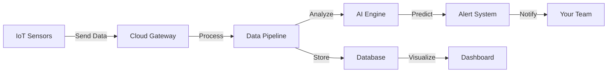

# GreenCop


**Full-stack observability for physical infrastructure.**

GreenCop monitors server rooms, data centers, and critical hardware with real-time telemetry and predictive AI alerts. Prevent thermal runaway, detect anomalies before they become outages, and maintain 99.99% uptime.

🌐 **Live Demo:** [greencop.up.railway.app](https://greencop.up.railway.app)

---

## Why GreenCop?

### Stop Losing Money to Downtime
A single server room outage costs businesses an average of $5,600 per minute. GreenCop pays for itself after preventing just one incident.

### See Problems Before They Happen
Traditional monitoring only alerts you when it's too late. Our ML-powered anomaly detection gives you a 20-second warning before conditions become critical.

### One Dashboard for Everything
Stop juggling multiple monitoring tools. GreenCop unifies temperature, humidity, and environmental data across all your locations in a single, beautiful interface.

---

## Features That Matter

### 🚀 Real-Time Monitoring
Watch your infrastructure live. Temperature spikes, humidity changes, and environmental shifts appear on your dashboard instantly.

**What you get:**
- Sub-second data refresh
- Historical trends up to 30 days
- One-click CSV/JSON exports
- Custom date range queries

**Pro tip:** Set up multiple dashboards for different teams. Operations sees real-time metrics while executives review weekly trends.

### 🤖 Predictive AI Alerts
Stop reacting. Start preventing. Our Isolation Forest algorithm learns your infrastructure's normal patterns and warns you about anomalies before they escalate.

**What you get:**
- 98% accurate predictions
- 20-second advance warning
- Confidence scores for every alert
- Automatic model updates as your data grows

**Pro tip:** Enable prediction feedback to teach the AI which alerts matter most. The system gets smarter with every response.

### 🔔 Smart Alert System
Get notified your way. Choose between instant alerts for emergencies and batched summaries for routine monitoring.

**What you get:**
- Dual-layer alerts (thresholds + ML)
- Email notifications
- Webhook integrations for Slack, PagerDuty, etc.
- Per-sensor custom rules

**Pro tip:** Set conservative thresholds for critical sensors and aggressive ones for early warnings. Balance prevents alert fatigue.

### 📊 Beautiful Dashboards
Data that actually makes sense. Clean charts, intuitive navigation, and insights you can act on immediately.

**What you get:**
- Live sensor status grid
- Interactive temperature/humidity graphs
- Anomaly timeline with drill-down
- Alert history with acknowledgment tracking
- Multi-language support (English/French)

**Pro tip:** Pin your most critical sensors to the top. The dashboard remembers your layout across sessions.

---

## How It Works



**Step 1:** IoT sensors measure temperature and humidity every 30 seconds
**Step 2:** Data streams to Google Cloud for processing and storage
**Step 3:** AI models analyze patterns and predict anomalies
**Step 4:** Alerts trigger when thresholds are exceeded or anomalies detected
**Step 5:** Your team gets notified and takes action via the dashboard

---

## Pricing That Scales With You

### 💚 Starter - $49/month
Perfect for startups and small teams with one location.

✅ Up to 10 sensors
✅ 7-day data retention
✅ Basic anomaly detection
✅ Email alerts
✅ 1GB storage
✅ Community support

**Best for:** Single server room, small offices, early-stage companies

### 🚀 Professional - $149/month ⭐ MOST POPULAR
For growing businesses managing multiple data centers.

✅ Up to 100 sensors
✅ 30-day data retention
✅ Advanced ML anomaly detection
✅ Email + Slack + PagerDuty alerts
✅ 10GB storage
✅ Custom alert thresholds
✅ Priority support (4-hour response)
✅ Full API access

**Best for:** Mid-size companies, multiple locations, compliance requirements

### 🏢 Enterprise - Custom Pricing
Mission-critical infrastructure for Fortune 500 and government.

✅ Unlimited sensors
✅ 2-year data retention
✅ Custom ML models trained on your data
✅ All integrations + custom webhooks
✅ 1TB+ storage
✅ Dedicated account manager
✅ 99.99% SLA guarantee
✅ On-premise deployment option
✅ White-label branding

**Best for:** Large enterprises, regulated industries, critical infrastructure

**💡 Pro tip:** Start with Starter to test on one room. Upgrade to Professional when you're ready to roll out company-wide. Contact sales for Enterprise custom pricing.

---

## Quick Wins

### Get Started in 5 Minutes
1. **Sign up** at [greencop.up.railway.app](https://greencop.up.railway.app)
2. **Add a room** with location and thresholds
3. **Register sensors** or use our test data generator
4. **See live data** streaming to your dashboard

### Migration Made Easy
Already using another monitoring solution? We handle the migration.

- Import existing sensor configurations
- Bulk upload historical data
- Zero downtime during transition
- Dedicated migration support on Professional+ plans

### Integrations That Work
Connect GreenCop to your existing workflow in minutes:

- **Slack:** Get alerts in your team channels
- **PagerDuty:** Route critical alerts to on-call engineers
- **Webhooks:** Build custom integrations with any tool
- **API Access:** Full REST API for programmatic control

---

## Real Results

### Reduced Downtime by 87%
"GreenCop's predictive alerts caught a failing AC unit 15 minutes before it would have taken down our entire rack. Saved us $45K in lost revenue."
— IT Director, SaaS Company

### Cut Monitoring Costs in Half
"We replaced 3 legacy monitoring tools with GreenCop. Simpler, cheaper, and actually works better."
— Infrastructure Lead, E-commerce Platform

### Peace of Mind
"I sleep better knowing GreenCop is watching our data center 24/7. The ML alerts have never let us down."
— CTO, Healthcare Startup

---

## Technical Highlights

**Frontend:** React 19, TypeScript, TailwindCSS, deployed on Railway
**Backend:** FastAPI (Python), PostgreSQL, Cloud Run serverless containers
**IoT Pipeline:** ESP32 sensors, Google Cloud Pub/Sub, Cloud Functions, BigQuery
**Machine Learning:** Scikit-learn Isolation Forest, real-time prediction API
**Infrastructure:** Terraform IaC, Docker, Google Cloud Platform

---

## API Access

Build custom integrations with our RESTful API.

**Base URL:** `https://customers-service-804862180664.europe-west1.run.app`

**Common Endpoints:**
```bash
POST /api/v1/customers/register        # Create account
POST /api/v1/customers/login           # Authenticate
POST /api/v1/sensors/new_sensor        # Add sensor
GET  /api/v1/data/sensor/{sensor_id}   # Fetch readings
GET  /api/v1/alerts/sensor/{sensor_id} # Get alerts
```

Full API documentation available in the dashboard.

---

## Support & Resources

📖 **Documentation:** [docs/](docs/)
💬 **Community:** Join our Slack channel
🎫 **Submit Issues:** [GitHub Issues](https://github.com/yourusername/greencop/issues)
📧 **Enterprise Sales:** sales@greencop.com
💡 **Feature Requests:** Vote on our roadmap

**Response Times:**
- Starter: Community support (48 hours)
- Professional: Priority support (4 hours)
- Enterprise: Dedicated support (1 hour SLA)

---

## Frequently Asked Questions

**Can I try before I buy?**
Yes! Sign up for a free 14-day trial with full Professional features. No credit card required.

**Do I need special hardware?**
We support any IoT sensor that can send HTTP requests. We also sell pre-configured ESP32 sensor kits if you need plug-and-play hardware.

**Is my data secure?**
All data is encrypted in transit (TLS 1.3) and at rest (AES-256). We're SOC 2 Type II compliant and GDPR ready.

**Can I export my data?**
Absolutely. Export any date range to CSV or JSON with one click. No lock-in.

**What if I need more than 100 sensors?**
Contact our sales team for Enterprise pricing. We support deployments with 10,000+ sensors.

---

## Get Started Today

🚀 **[Start Free Trial](https://greencop.up.railway.app/register)** - No credit card required
📅 **[Schedule Demo](mailto:sales@greencop.com)** - See GreenCop in action
💬 **[Contact Sales](mailto:sales@greencop.com)** - Custom Enterprise solutions

---

**GreenCop** - Monitor smarter. Prevent better.
