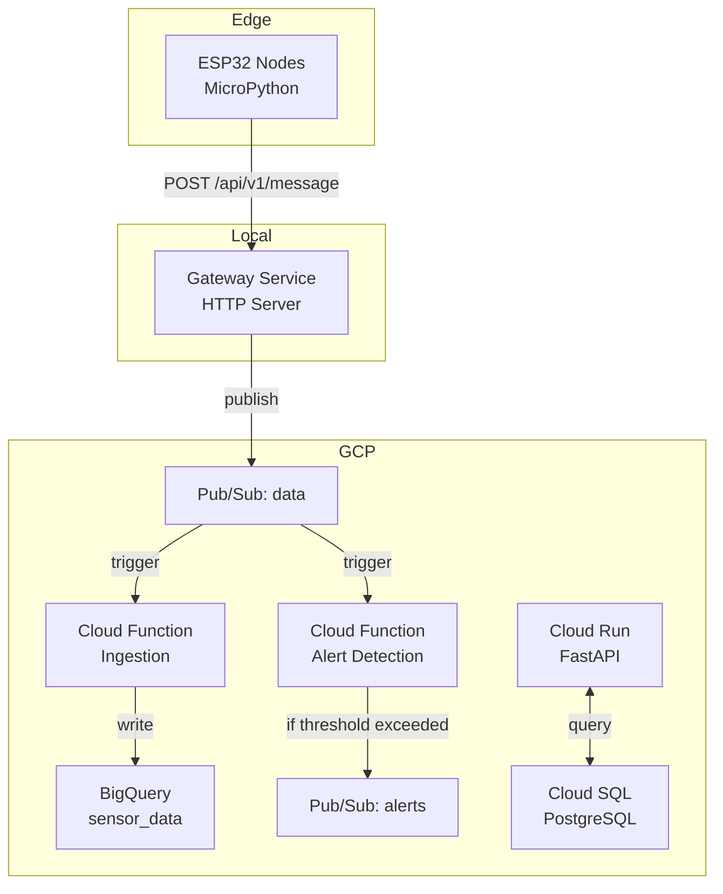

# GreenCop


IoT monitoring system for temperature and humidity sensors. Event-driven architecture on GCP with ESP32 hardware nodes.

## Architecture



## Components

**ESP32 Sensors:**
- WiFi-enabled nodes running MicroPython
- POST sensor readings to gateway via HTTP
- LED indicators on GPIO 5 (green, publishing) and GPIO 4 (red, errors)
- Auto-register with unique hardware ID
- Heartbeat protocol for health monitoring

**Gateway Service:**
- Local HTTP server for receiving sensor data
- Publishes to GCP Pub/Sub `data` topic
- mDNS discovery at `greencop-gateway.local`

**Cloud Functions:**
- **Data Ingestion**: Pub/Sub → BigQuery pipeline
- **Alert Detection**: Checks temp/humidity thresholds, publishes to `alerts` topic

**Customer API:**
- FastAPI backend on Cloud Run
- PostgreSQL on Cloud SQL
- Manages customers, rooms, sensor metadata

**BigQuery:**
- Table: `sensor_data.readings`
- Schema: `node_id`, `message_id`, `timestamp`, `temperature`, `humidity`
- Partitioned by day, clustered by `node_id` and `message_id`

**Infrastructure:**
- Terraform modules for all GCP resources
- Pub/Sub topics, Cloud Functions, BigQuery, Cloud SQL, Cloud Run

## Run

### Deploy Infrastructure
```bash
cd infra/terraform
terraform init
terraform plan
terraform apply
```

### Run Customer API
```bash
cd services/customers
docker-compose up
```

### Deploy Cloud Functions

Data ingestion:
```bash
cd services/data
zip -r function_source.zip main.py requirements.txt
# Upload via Terraform or GCP Console
```

Alert detection:
```bash
cd services/alerts
zip -r function_source.zip main.py requirements.txt
# Upload via Terraform or GCP Console
```

### Flash ESP32
```python
# services/sensors/hardware/config.py
WIFI_SSID = "your-wifi"
WIFI_PASSWORD = "your-password"

# Upload main.py to ESP32
# Connect LEDs: GPIO 5 (green), GPIO 4 (red) with 220Ω resistors
```

## Environment Variables

Alert Detection:
```bash
PROJECT_ID=your-gcp-project
MAX_ALLOWED_TEMP=50.0
MAX_ALLOWED_HUMIDITY=50.0
ALERT_TOPIC=alerts
```

Data Ingestion:
```bash
PROJECT_ID=your-gcp-project
DATASET_ID=sensor_data
TABLE_ID=readings
```

## API Endpoints

**Customer Management:**
- `POST /api/v1/customers/register`
- `POST /api/v1/customers/login`
- `GET /api/v1/customers/info/{id}`

**Rooms:**
- `POST /api/v1/server_rooms/new_room`
- `GET /api/v1/server_rooms/{room_id}`
- `PUT /api/v1/server_rooms/{room_id}`
- `DELETE /api/v1/server_rooms/{room_id}`

**Sensors:**
- `POST /api/v1/sensors/new_sensor`
- `GET /api/v1/sensors/sensor/{sensor_id}`
- `GET /api/v1/sensors/list_sensors/{room_id}`
- `PUT /api/v1/sensors/update_sensor/{sensor_id}`
- `DELETE /api/v1/sensors/delete_sensor/{sensor_id}`

**Gateway:**
- `POST /api/v1/register` - Register sensor node
- `POST /api/v1/message` - Publish sensor data
- `POST /api/v1/heartbeat` - Health check

## TODO

- Alert notifications (email/SMS)
- Frontend dashboard
- ML anomaly detection
- Dead-letter queues