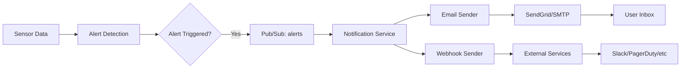

# Notifications 🔔

## Overview

GreenCop's notification system delivers real-time alerts through multiple channels when anomalies are detected, thresholds are exceeded, or model training completes.

**Status**: ✅ **Implemented and Active**

## Supported Notification Channels

### 📧 Email Notifications

**Available on**: All plans (Developer, Small Team, Scale, Mission Critical)

Email notifications are sent automatically for:
- **Anomaly alerts** - When ML models detect unusual sensor behavior
- **Threshold alerts** - When temperature/humidity exceeds configured limits
- **Model training completion** - When ML retraining finishes
- **System alerts** - Critical system events

**Email Templates**:
- Professional HTML templates with branding
- Inline metrics and charts
- Direct links to dashboard for investigation
- Mobile-responsive design

!!! example "Sample Email Alert"
    **Subject**: 🚨 Anomaly Detected - Server Room 1

    Sensor: `20e7c89f14ec`
    Temperature: 28.5°C (predicted: 24.2°C)
    Confidence: 94%
    Time: 2026-01-03 14:23:15 UTC

    [View in Dashboard →](https://greencop.up.railway.app/anomalies)

### 🔗 Webhook Notifications

**Available on**: Small Team, Scale, Mission Critical plans

Webhook notifications enable integration with:
- **Slack** - Post alerts to channels
- **Microsoft Teams** - Team notifications
- **PagerDuty** - Incident management
- **Custom endpoints** - Your own services

**Webhook Payload Format**:
```json
{
  "event_type": "anomaly_detected",
  "timestamp": "2026-01-03T14:23:15Z",
  "sensor_id": "20e7c89f14ec",
  "room_name": "Server Room 1",
  "alert_data": {
    "metric": "temperature",
    "current_value": 28.5,
    "predicted_value": 24.2,
    "confidence": 0.94
  },
  "dashboard_url": "https://greencop.up.railway.app/anomalies"
}
```

## Notification Configuration

### Email Setup

Email notifications are **enabled by default** for all users. No configuration required!

**Email Settings** (Settings Page):
1. Navigate to **Dashboard → Settings**
2. Scroll to **Notification Preferences**
3. Configure email preferences:
   - Enable/disable specific alert types
   - Set quiet hours (coming soon)
   - Configure email frequency (immediate vs. digest)

### Webhook Setup

!!! warning "⚠️ Webhook Feature"
    Webhook configuration UI is currently in development. Contact support@greencop.com to manually configure webhooks for your account.

**Planned Webhook Configuration**:
1. Navigate to **Dashboard → Settings → Webhooks**
2. Click **Add Webhook**
3. Enter webhook URL
4. Select alert types to forward
5. Test webhook connection
6. Save configuration

## Alert Types

### Anomaly Alerts

Triggered when ML models detect unusual patterns:

**Email Subject**: `🚨 Anomaly Detected - [Room Name]`

**Contains**:
- Sensor ID and location
- Current vs. predicted values
- Anomaly confidence score
- Timestamp
- Link to anomalies dashboard

### Threshold Alerts

Triggered when metrics exceed configured thresholds:

**Email Subject**: `⚠️ Threshold Exceeded - [Room Name]`

**Contains**:
- Metric type (temperature/humidity)
- Current value vs. threshold
- Sensor ID and location
- Timestamp
- Suggested actions

### Training Completion Alerts

Triggered when ML model retraining completes:

**Email Subject**: `✅ Model Training Complete - [Model Version]`

**Contains**:
- Training metrics (F1, RMSE, MAE, Accuracy)
- Number of predictions used for training
- Model version number
- Performance comparison to previous version
- Link to models dashboard

## Notification Architecture



## Service Implementation

### Email Service (Python)

**Location**: `/services/notifications/email_sender.py`

**Features**:
- HTML email templates with Jinja2
- Inline CSS for maximum compatibility
- Automatic retry on send failure
- Rate limiting to prevent spam
- Template rendering with dynamic data

**Email Templates**:
- `anomaly_detected.html` - Anomaly alerts
- `threshold_exceeded.html` - Threshold alerts
- `training_complete.html` - ML training completion

### Webhook Service (Go)

**Location**: `/services/notifications/webhook_sender.go`

**Features**:
- HTTP POST to configured endpoints
- Automatic retry with exponential backoff
- Timeout protection (10 seconds)
- Payload signing for security
- Error logging and monitoring

## Notification Preferences

Access notification settings:

1. **Login** to GreenCop dashboard
2. Navigate to **Settings**
3. Scroll to **Notifications** section

**Available Options**:
- ✅ Enable/disable email notifications
- 🔕 Quiet hours (coming soon)
- 📊 Email digest frequency (coming soon)
- 🔗 Webhook management (coming soon)

## Best Practices

!!! success "✅ Best Practice: Start with Email"
    Enable email notifications first. Once you understand alert patterns, configure webhooks for urgent alerts only.

!!! tip "💡 Tip: Use Webhooks for Critical Alerts"
    Route high-confidence anomaly alerts to PagerDuty for immediate response. Use email for threshold warnings and training updates.

!!! info "ℹ️ Info: Prevent Alert Fatigue"
    Configure appropriate thresholds to avoid excessive notifications. Review alert frequency weekly and adjust thresholds as needed.

## Troubleshooting

### Not Receiving Email Alerts?

**Check**:
1. Email address is verified in your account
2. Check spam/junk folder
3. Verify notification preferences are enabled
4. Contact support@greencop.com if issue persists

### Webhook Not Triggering?

**Verify**:
1. Webhook URL is publicly accessible
2. Endpoint returns 2xx status code
3. Request timeout is < 10 seconds
4. Check notification service logs for errors

## Examples

### Slack Webhook Integration

**Incoming Webhook URL**:
```
https://hooks.slack.com/services/YOUR/WEBHOOK/URL
```

**Expected Payload** (from GreenCop):
```json
{
  "text": "🚨 Anomaly Detected",
  "blocks": [
    {
      "type": "section",
      "text": {
        "type": "mrkdwn",
        "text": "*Anomaly Alert*\nSensor: 20e7c89f14ec\nTemperature: 28.5°C"
      }
    }
  ]
}
```

### Custom Webhook Handler (Python)

```python
from flask import Flask, request

app = Flask(__name__)

@app.route('/greencop/webhook', methods=['POST'])
def handle_greencop_alert():
    data = request.json

    if data['event_type'] == 'anomaly_detected':
        # Your custom logic
        send_to_monitoring_system(data)
        trigger_hvac_adjustment(data['sensor_id'])

    return {'status': 'received'}, 200
```

## Pricing & Availability

| Plan | Email | Webhooks | SMS (Future) |
|------|-------|----------|--------------|
| Developer | ✅ | ❌ | ❌ |
| Small Team | ✅ | ✅ | ❌ |
| Scale | ✅ | ✅ | 📅 Planned |
| Mission Critical | ✅ | ✅ | 📅 Planned |

## Related Documentation

- [Alert Configuration](alerts.md) - Configure threshold and anomaly alerts
- [Settings](../user-guide/settings.md) - Manage notification preferences
- [API Reference](../api-reference/alerts.md) - Programmatic alert access

## Future Enhancements

📅 **Planned Features**:
- SMS notifications via Twilio
- Push notifications (mobile app)
- Discord integration
- Quiet hours configuration
- Alert escalation rules
- Notification digest mode

---

**Need help?** Contact support@greencop.com or check the [troubleshooting guide](../hardware/troubleshooting.md).
