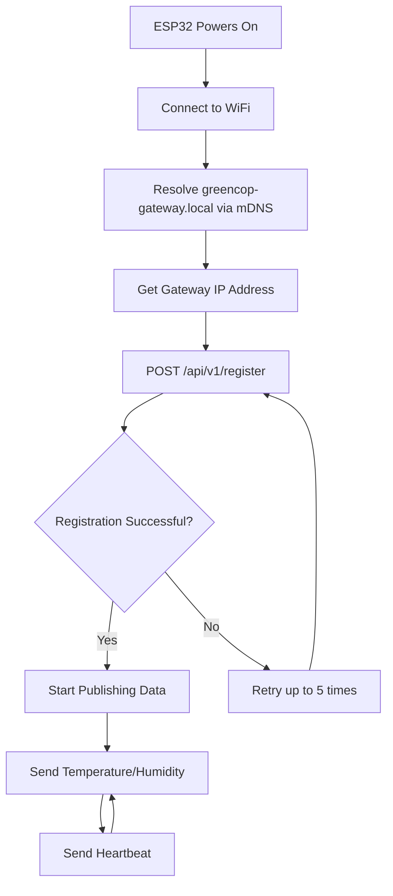

# Sensor Monitoring

## Why Real-Time Monitoring Matters

By the time you notice a server room is hot, hardware is already throttling. By the time an alarm sounds, damage may be done. Real-time monitoring gives you visibility before problems escalate.

**Business Value**: Sub-second telemetry means you can react to environmental drift in minutes, not hours. One prevented hardware failure pays for years of monitoring.

## Sensor Monitoring Overview

GreenCop's sensor monitoring provides continuous tracking of environmental conditions through ESP32-based IoT sensor nodes. Each sensor autonomously collects and transmits temperature and humidity data to the cloud for processing and visualization.

!!! tip "Sensor Placement Strategy"
    Place sensors at the top of racks where heat accumulates, not at floor level. One sensor per 4-6 racks is typically sufficient. Start small (2-3 sensors) to validate ROI before deploying fleet-wide.

## Sensor Types

### ESP32 Nodes

**Hardware**: ESP32 WiFi-enabled microcontroller
**Firmware**: MicroPython
**Measurements**: Temperature and Humidity
**Update Frequency**: Configurable (default: every 30 seconds)

## Real-Time Features

### Auto-Polling

- Dashboard auto-refreshes sensor data every 10 seconds
- No manual refresh needed
- Latest readings always visible
- Minimal latency (<5 seconds from sensor to dashboard)

### Live Status Indicators

- **Green LED** (GPIO 5): Sensor is publishing data
- **Red LED** (GPIO 4): Error condition
- **No LEDs**: Sensor offline or not configured

## Sensor Data

### Temperature

- **Unit**: Degrees Celsius (°C)
- **Range**: -40°C to 125°C (ESP32 limit)
- **Precision**: 0.1°C
- **Display**: One decimal place

### Humidity

- **Unit**: Relative Humidity (%)
- **Range**: 0% to 100%
- **Precision**: 0.1%
- **Display**: One decimal place

## Viewing Sensor Data

### Sensors Page

Browse all sensors across all rooms:

1. Navigate to **Sensors** in sidebar
2. View grid of sensor cards
3. Each card shows:
   - Sensor name
   - Room assignment
   - Current temperature (orange)
   - Current humidity (blue)
   - Last update timestamp
4. Click any sensor card for detailed view

### Sensor Detail Page

Deep dive into individual sensor performance:

1. Click a sensor from Sensors page
2. View large current readings
3. Select time range: 1 Hour, 24 Hours, or 7 Days
4. See temperature trend chart
5. See humidity trend chart
6. Monitor historical patterns

### Dashboard View

Quick overview of all sensors:

- Bar chart comparing all sensors
- Average temperature across fleet
- Recent alerts related to sensors

## Data Accuracy

### Calibration

Sensors report raw measurements - calibration may be needed for precision applications.

### Data Validation

- Backend validates all incoming data
- Invalid readings are rejected
- Outliers flagged in logs
- BigQuery stores all accepted readings

## Monitoring Alerts

### Threshold Alerts

When sensor readings exceed configured thresholds:

1. Alert detection Cloud Function triggers
2. Alert published to Pub/Sub
3. Stored in database
4. Displayed on dashboard and alerts page

### Default Thresholds

- Maximum Temperature: 50°C
- Maximum Humidity: 50%

Customize thresholds in Settings page.

## Sensor Health

### Heartbeat Protocol

Sensors send periodic heartbeat messages to gateway:

- Confirms sensor is online
- Validates network connectivity
- Updates last-seen timestamp

### Offline Detection

If sensor stops reporting:

- Last update timestamp shows age
- No new data appears in charts
- Manual investigation required

## Data Storage

### BigQuery (Long-term)

- All sensor readings stored indefinitely
- Table: `sensor_data.readings`
- Partitioned by date for performance
- Query via API for historical analysis

### PostgreSQL (Metadata)

- Sensor configuration
- Room assignments
- Alert history

## Best Practices

### Placement

- Mount sensors in representative locations
- Avoid direct sunlight or heat sources
- Ensure good airflow around sensor
- Protect from physical damage

### Maintenance

- Check LED indicators regularly
- Verify data is flowing (check timestamps)
- Replace sensors showing erratic readings
- Keep firmware updated

### Monitoring

- Review sensor detail pages weekly
- Investigate sudden trend changes
- Acknowledge alerts promptly
- Remove decommissioned sensors from system

## Troubleshooting

### Sensor Not Reporting

**Symptoms**: No data on dashboard, old timestamp

**Checks**:
1. Verify sensor has power
2. Check WiFi connection
3. Confirm gateway is reachable
4. Review sensor LED indicators
5. Check gateway logs for messages

### Erratic Readings

**Symptoms**: Wild fluctuations, impossible values

**Possible Causes**:
- Poor sensor connection
- Electrical interference
- Hardware failure
- Firmware bug

**Solutions**:
- Reboot sensor
- Check wiring
- Re-flash firmware
- Replace sensor

### Data Not Updating

**Symptoms**: Sensor shows old data, no new readings

**Checks**:
1. Verify backend services running
2. Check Pub/Sub topics for messages
3. Confirm BigQuery ingestion function active
4. Review Cloud Function logs

## Next Steps

- [Configure Alerts](../user-guide/configuring-alerts.md)
- [View Data Analytics](data-analytics.md)
- [ESP32 Hardware Setup](../hardware/esp32-setup.md)
- [Sensor API Reference](../api-reference/sensors.md)
# Auto-Registration Process

## How Sensors Register Automatically

GreenCop features **zero-configuration sensor deployment** using mDNS and the Go gateway service.

### The Auto-Registration Flow



### Step-by-Step Process

#### 1. ESP32 Startup
```python
# From main.py
node = Node(config)
node._connect_wifi()  # Connect to WiFi from config.py
```

#### 2. mDNS Discovery
```python
# Resolve gateway hostname
SERVER_HOST_NAME = "greencop-gateway.local"
addr_info = usocket.getaddrinfo(SERVER_HOST_NAME, 8080)
gateway_ip = addr_info[0][-1][0]  # e.g., "192.168.1.100"
```

**Why mDNS?**
- No hardcoded IP addresses
- Works across DHCP changes
- Zero manual configuration
- Plug-and-play deployment

#### 3. Automatic Registration
```python
# ESP32 registers itself
payload = {
    "node_id": "20e7c89f14ec",  # Unique hardware ID
    "ip_addr": "192.168.1.42"    # ESP32's IP
}
response = requests.post(f"http://{gateway_ip}:8080/api/v1/register", json=payload)
```

**Go Gateway Receives**:
```go
// Gateway stores node in memory
func HandleRegisterNode(manager *core.Manager) http.HandlerFunc {
    return func(w http.ResponseWriter, r *http.Request) {
        var node Node
        json.NewDecoder(r.Body).Decode(&node)
        manager.RegisterNode(node)
        w.WriteHeader(http.StatusCreated)
    }
}
```

#### 4. Data Publishing
Once registered, sensor automatically publishes data:
```python
# Every 30 seconds (configurable)
payload = {
    "id": message_id,
    "node_id": self.node_id,
    "temperature": 25.3,
    "humidity": 45.2
}
requests.post(f"http://{gateway_ip}:8080/api/v1/message", json=payload)
```

**Go Gateway Routes to Cloud**:
```go
// Gateway publishes to Google Cloud Pub/Sub
func HandlePublishMessage(manager *core.Manager) http.HandlerFunc {
    // Receives sensor data
    // Publishes to Pub/Sub "data" topic
    // Returns 200 OK
}
```

### Benefits of Auto-Registration

✅ **No Manual Setup**
- Flash firmware once
- Configure WiFi credentials
- Power on → automatic registration

✅ **Scalable**
- Add unlimited sensors
- Each auto-registers independently
- No central configuration database

✅ **Resilient**
- Sensors retry registration on failure
- Re-register after power cycle
- Gateway tracks all registered nodes

✅ **Network Agnostic**
- Works with any WiFi network
- No DNS server required
- mDNS handles local discovery

### Monitoring Registration

**Check Registered Sensors**:
```bash
curl http://greencop-gateway.local:8080/api/v1/nodes
```

**Response**:
```json
{
  "nodes": [
    {
      "node_id": "20e7c89f14ec",
      "ip_addr": "192.168.1.42",
      "registered_at": "2025-01-15T10:00:00Z",
      "status": "online"
    }
  ]
}
```

### Troubleshooting Auto-Registration

**Sensor Can't Find Gateway**:
- Verify gateway is running
- Check mDNS: `ping greencop-gateway.local`
- Ensure same network segment
- Disable WiFi isolation on router

**Registration Fails**:
- Check gateway logs
- Verify ESP32 has internet connectivity
- Confirm WiFi credentials correct
- Red LED indicates error

**Sensor Shows Online but No Data**:
- Registration succeeded but publishing failed
- Check Pub/Sub topic exists
- Verify gateway has GCP credentials
- Review gateway logs for errors
