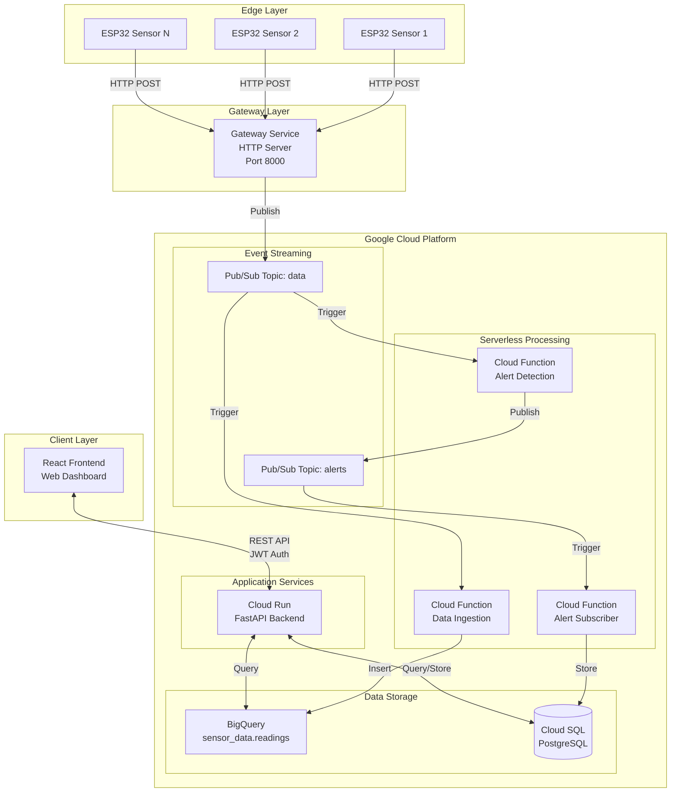
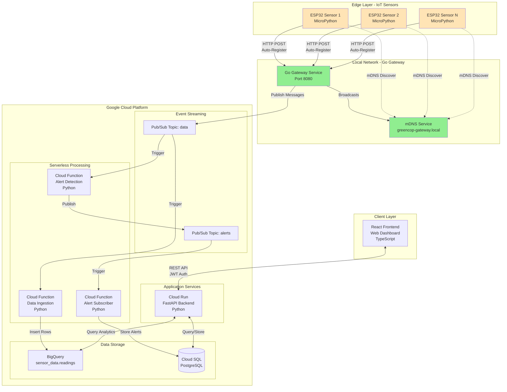
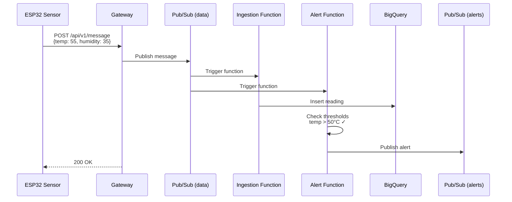
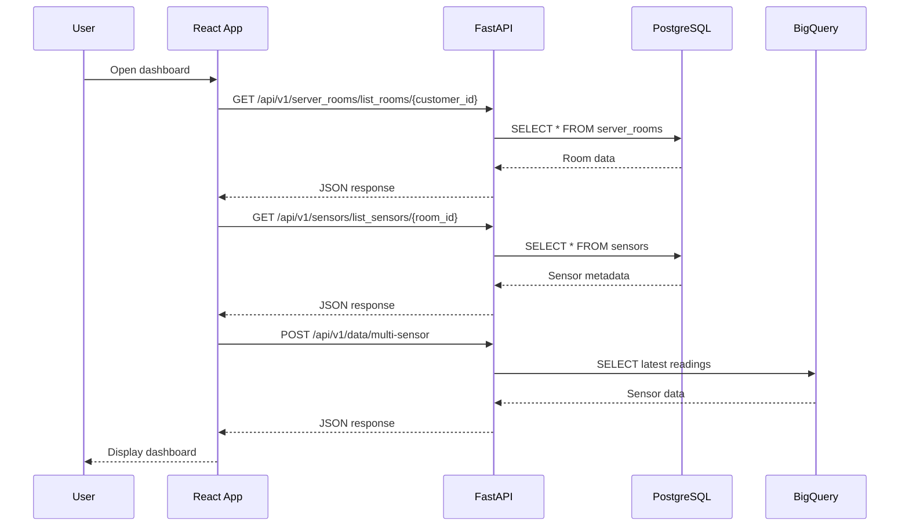
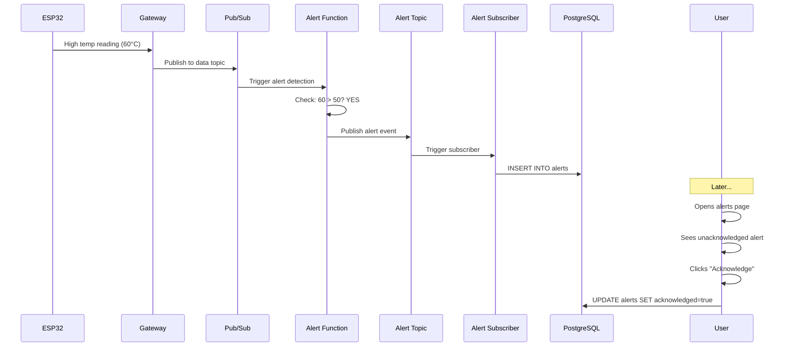
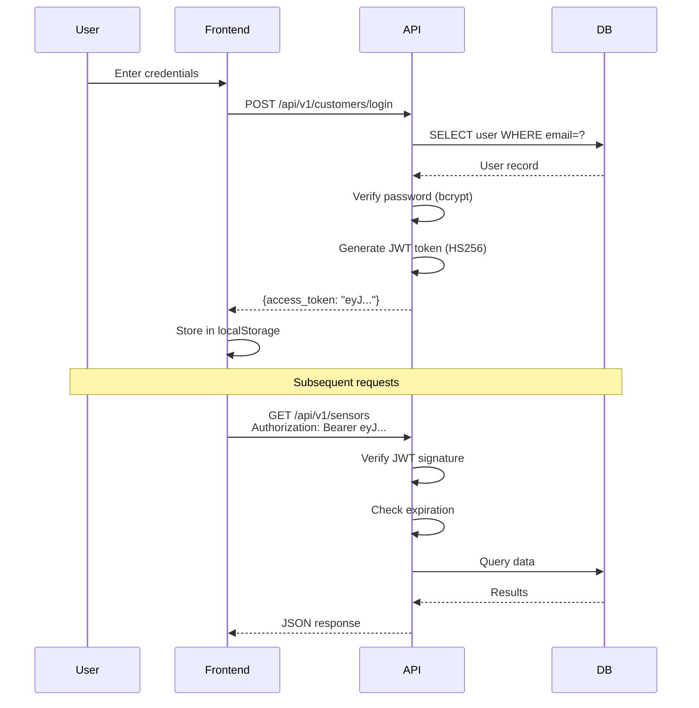

# System Architecture

This document provides a comprehensive overview of GreenCop's architecture, explaining how all components work together to create a scalable IoT monitoring system.

## Architecture Overview

GreenCop follows an **event-driven, cloud-native architecture** built on Google Cloud Platform. The system is divided into four main layers:

1. **Edge Layer**: ESP32 sensor nodes
2. **Gateway Layer**: Local HTTP server for data collection
3. **Cloud Layer**: GCP services for processing and storage
4. **Application Layer**: Backend API and frontend dashboard



## Component Details

## Updated System Architecture with Go Gateway



### Key Components

**Go Gateway (Local)**:
- Written in Go for performance
- HTTP server on port 8080
- mDNS broadcasting for auto-discovery
- Manages sensor registration
- Routes messages to GCP Pub/Sub

**Auto-Registration via mDNS**:
- Gateway broadcasts `greencop-gateway.local`
- ESP32 sensors discover gateway automatically
- No hardcoded IP addresses needed
- Zero-configuration deployment

**Distributed System Architecture**:
- **Edge**: ESP32 sensors (autonomous, auto-registering)
- **Coordination**: Go gateway (local aggregator)
- **Cloud**: GCP services (processing & storage)

### Edge Layer: ESP32 Sensors

**Technology**: ESP32 microcontroller with MicroPython

**Responsibilities**:

- Read temperature/humidity from sensors
- Connect to WiFi network
- Auto-register with gateway
- Publish readings via HTTP POST
- Provide visual status via LED indicators
- Send heartbeat for health monitoring

**Key Features**:

- **Autonomous Operation**: Sensors operate independently
- **Auto-Registration**: Unique hardware ID for identification
- **LED Status Indicators**:
    - GPIO 5 (Green): Data publishing in progress
    - GPIO 4 (Red): Error conditions
- **Configurable Interval**: Adjustable reading frequency

**Code Location**: `/services/sensors/hardware/main.py`

**Data Format**:

```json
{
  "node_id": "esp32_abc123",
  "temperature": 25.3,
  "humidity": 45.2,
  "timestamp": "2025-01-15T10:30:00Z"
}
```

### Gateway Layer

**Technology**: HTTP server (local or cloud-hosted)

**Responsibilities**:

- Receive sensor data via HTTP POST
- Validate incoming messages
- Publish to Google Cloud Pub/Sub
- Handle sensor registration
- Process heartbeat requests

**Endpoints**:

- `POST /api/v1/message`: Receive sensor data
- `POST /api/v1/register`: Register new sensor
- `POST /api/v1/heartbeat`: Health check

**Code Location**: `/services/gateway/` (if using separate gateway)

**Discovery**: Available via mDNS at `greencop-gateway.local`

### Cloud Layer

#### 1. Event Streaming: Google Cloud Pub/Sub

**Purpose**: Decouple data producers from consumers

**Topics**:

- **data**: Raw sensor readings from gateway
- **alerts**: Alert events when thresholds exceeded

**Benefits**:

- Scalable message delivery
- At-least-once delivery guarantee
- Multiple subscribers per topic
- Message buffering and retry

**Configuration**: `/infra/terraform/modules/pubsub/`

#### 2. Serverless Processing: Cloud Functions

##### Data Ingestion Function

**Trigger**: Pub/Sub topic `data`
**Purpose**: Stream sensor data to BigQuery
**Runtime**: Python 3.12

**Process**:

1. Receive message from Pub/Sub
2. Parse and validate sensor data
3. Insert into BigQuery table
4. Acknowledge message

**Code**: `/services/pubsub_bq_bridge/main.py`

**Environment Variables**:

- `PROJECT_ID`: GCP project
- `DATASET_ID`: BigQuery dataset (default: `sensor_data`)
- `TABLE_ID`: BigQuery table (default: `readings`)

##### Alert Detection Function

**Trigger**: Pub/Sub topic `data`
**Purpose**: Detect threshold violations
**Runtime**: Python 3.12

**Process**:

1. Receive sensor reading
2. Check against thresholds:
    - Temperature > 50°C
    - Humidity > 40%
3. If exceeded, publish to `alerts` topic

**Code**: `/services/alerts/main.py`

**Thresholds** (configurable via environment):

```python
MAX_ALLOWED_TEMP = 50.0      # Celsius
MAX_ALLOWED_HUMIDITY = 50.0  # Percentage
```

##### Alert Subscriber Function

**Trigger**: Pub/Sub topic `alerts`
**Purpose**: Store alerts in database
**Runtime**: Python 3.12

**Process**:

1. Receive alert from Pub/Sub
2. Determine alert type (temperature/humidity)
3. Insert into PostgreSQL alerts table
4. Mark as unacknowledged

**Code**: `/services/alert_subscriber/main.py`

#### 3. Data Storage

##### BigQuery: Time-Series Data Warehouse

**Dataset**: `sensor_data`
**Table**: `readings`

**Schema**:

| Column | Type | Description |
|--------|------|-------------|
| node_id | STRING | Sensor identifier |
| message_id | STRING | Unique message ID |
| timestamp | TIMESTAMP | Reading time (UTC) |
| temperature | FLOAT64 | Temperature in Celsius |
| humidity | FLOAT64 | Relative humidity (%) |

**Optimization**:

- Partitioned by `timestamp` (daily partitions)
- Clustered by `node_id` and `message_id`
- Optimized for time-range queries

**Use Cases**:

- Historical data analysis
- Trend visualization
- Statistics computation
- Long-term storage

##### Cloud SQL (PostgreSQL): Metadata Storage

**Database**: `greencop`

**Tables**:

- **customers**: User accounts
- **server_rooms**: Physical/logical rooms
- **sensors**: Sensor metadata
- **alerts**: Alert history
- **alert_thresholds**: Per-customer thresholds

**Schema Details**:

```sql
-- customers table
CREATE TABLE customers (
    id SERIAL PRIMARY KEY,
    username VARCHAR(80) UNIQUE NOT NULL,
    password_hash VARCHAR(120) NOT NULL,
    email VARCHAR(120) UNIQUE NOT NULL
);

-- server_rooms table
CREATE TABLE server_rooms (
    id SERIAL PRIMARY KEY,
    name VARCHAR(120) NOT NULL,
    customer_id INTEGER REFERENCES customers(id)
);

-- sensors table
CREATE TABLE sensors (
    id SERIAL PRIMARY KEY,
    name VARCHAR(80) NOT NULL,
    type VARCHAR(50) NOT NULL,
    room_id INTEGER REFERENCES server_rooms(id)
);

-- alerts table
CREATE TABLE alerts (
    id SERIAL PRIMARY KEY,
    sensor_id VARCHAR(50) NOT NULL,
    alert_type VARCHAR(50) NOT NULL,
    message TEXT,
    timestamp TIMESTAMP DEFAULT NOW(),
    acknowledged BOOLEAN DEFAULT FALSE
);

-- alert_thresholds table
CREATE TABLE alert_thresholds (
    id SERIAL PRIMARY KEY,
    customer_id INTEGER REFERENCES customers(id),
    max_temperature FLOAT DEFAULT 50.0,
    max_humidity FLOAT DEFAULT 50.0
);
```

**Migrations**: Managed with Alembic (`/services/customers/alembic/`)

#### 4. Application Services: Cloud Run

**Service**: FastAPI Backend
**Container**: Docker image on Google Container Registry
**Scaling**: Automatic based on request load

**Responsibilities**:

- REST API for frontend
- User authentication (JWT)
- CRUD operations for rooms/sensors
- Query BigQuery for sensor data
- Manage alerts and thresholds

**Code**: `/services/customers/main.py`

**Configuration**: `/infra/terraform/modules/cloud_run/`

### Application Layer

#### Backend: FastAPI

**Framework**: FastAPI with Uvicorn
**Language**: Python 3.12
**ORM**: SQLAlchemy 2.0+

**Architecture**:

```
services/customers/
├── main.py              # Application entry point
├── api/
│   ├── routes/          # Endpoint definitions
│   │   ├── customer.py
│   │   ├── server_room.py
│   │   ├── sensor.py
│   │   ├── data.py
│   │   └── alert.py
│   ├── schemas/         # Pydantic models
│   └── utils/           # Auth, hashing utilities
├── database/
│   ├── session.py       # Database connection
│   └── models/          # SQLAlchemy models
└── alembic/             # Database migrations
```

**Key Features**:

- Automatic API documentation (Swagger/OpenAPI)
- Request/response validation (Pydantic)
- JWT-based authentication
- CORS middleware for frontend
- BigQuery integration for analytics

#### Frontend: React Dashboard

**Framework**: React 19.2.0 with TypeScript
**Build Tool**: Vite
**Styling**: Tailwind CSS
**Charts**: Recharts

**Architecture**:

```
web/frontend/src/
├── main.tsx             # Entry point
├── App.tsx              # Router configuration
├── pages/               # Page components
│   ├── DashboardPage.tsx
│   ├── RoomsPage.tsx
│   ├── SensorsPage.tsx
│   ├── SensorDetailPage.tsx
│   ├── AlertsPage.tsx
│   ├── SettingsPage.tsx
│   └── AssistantPage.tsx
├── components/
│   ├── layout/          # Layout components
│   └── ui/              # Reusable UI components
├── api/
│   ├── client.ts        # Axios instance
│   └── services/        # API service methods
├── hooks/               # Custom React hooks
├── context/             # React Context (Auth)
└── types/               # TypeScript types
```

**Key Features**:

- Protected routes with auth check
- Real-time data polling
- Interactive charts and graphs
- Responsive design
- JWT token management

## Data Flow Scenarios

### Scenario 1: Sensor Reading Flow



### Scenario 2: User Views Dashboard



### Scenario 3: Alert Triggered



## Scaling Considerations

### Horizontal Scaling

**ESP32 Sensors**: Add unlimited sensors; each auto-registers

**Gateway**: Stateless; can run multiple instances behind load balancer

**Cloud Functions**: Auto-scale based on Pub/Sub message volume

**Cloud Run**: Auto-scales API based on request count

**BigQuery**: Automatically handles increasing data volume

### Vertical Scaling

**PostgreSQL**: Upgrade Cloud SQL instance for more connections/memory

**Frontend**: CDN distribution for global users

### Cost Optimization

- BigQuery partitioning reduces query costs
- Cloud Functions only charged when executing
- Cloud Run scales to zero when not in use
- Pub/Sub message retention configurable

## Security Architecture

### Authentication Flow



### Security Measures

- **JWT Tokens**: 30-minute expiration
- **Password Hashing**: bcrypt with salt
- **CORS**: Restricted origins
- **HTTPS**: All cloud communication encrypted
- **IAM**: Google Cloud service accounts with minimal permissions
- **API Keys**: Not exposed in frontend code

## Monitoring & Observability

### Metrics

- **Cloud Functions**: Execution count, errors, duration
- **Cloud Run**: Request count, latency, instance count
- **BigQuery**: Query costs, slot usage
- **Pub/Sub**: Message count, age, delivery rate

### Logging

- **Application Logs**: Cloud Logging
- **Function Logs**: Cloud Functions logs
- **API Logs**: FastAPI access logs

### Alerting

- **GCP Alerts**: Configure via Cloud Monitoring
- **Application Alerts**: Temperature/humidity thresholds

## Infrastructure as Code

All infrastructure defined in Terraform:

```
infra/terraform/
├── main.tf              # Main orchestration
├── variables.tf         # Input variables
├── outputs.tf           # Output values
└── modules/
    ├── cloud_run/       # API service
    ├── cloud_sql/       # PostgreSQL
    ├── pubsub/          # Event topics
    ├── cloud_function/  # Serverless functions
    └── bigquery/        # Data warehouse
```

**Benefits**:

- Reproducible infrastructure
- Version-controlled changes
- Environment parity (dev/prod)
- Easy disaster recovery

## Technology Choices

### Why ESP32?

- WiFi built-in
- Low cost ($5-10)
- MicroPython support
- GPIO for LED indicators
- Large community

### Why Google Cloud?

- Serverless options (Functions, Run)
- BigQuery for analytics
- Pub/Sub for event streaming
- Integrated IAM
- Free tier for development

### Why FastAPI?

- High performance (async)
- Automatic API docs
- Type validation
- Modern Python features
- Easy to learn

### Why React?

- Component-based
- Large ecosystem
- TypeScript support
- Fast development
- Production-ready

## Future Architecture Enhancements

### Planned Features

1. **ML Anomaly Detection**: Identify unusual patterns
2. **Email/SMS Notifications**: Alert delivery
3. **AI Assistant**: Natural language queries
4. **Gateway Redundancy**: High availability
5. **Dead Letter Queue**: Handle failed messages

### Potential Optimizations

- Redis caching layer
- GraphQL instead of REST
- WebSocket for real-time updates
- Edge computing for local processing
- Multi-region deployment

## Next Steps

- [Understand Features](../features/dashboard.md)
- [Deploy Infrastructure](../development/terraform.md)
- [Explore API](../api-reference/overview.md)
- [Set Up Sensors](../hardware/esp32-setup.md)

## Gateway Service Architecture

For detailed information about the Go gateway service and mDNS auto-discovery, see:

[Distributed Architecture & Auto-Discovery](architecture-update.md)

**Quick Summary**:
- **Language**: Go
- **Purpose**: Bridge between ESP32 sensors and cloud
- **Key Feature**: mDNS broadcasting at `greencop-gateway.local`
- **Endpoints**: `/api/v1/register`, `/api/v1/message`, `/api/v1/heartbeat`
- **Zero-Config**: Sensors auto-discover gateway via mDNS
