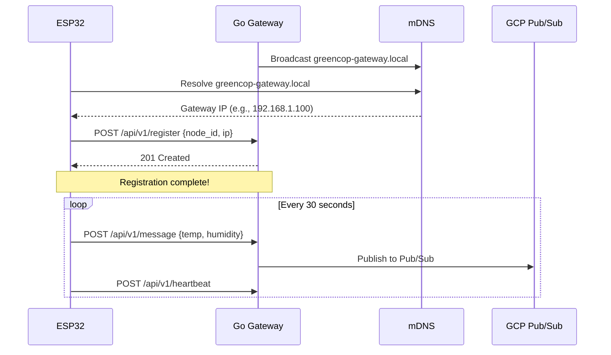

# Installation Guide

This guide walks you through a complete installation of GreenCop, from infrastructure setup to deploying your first sensor.

## Installation Options

Choose your installation method:

=== "Local Development"
    Best for testing and development. Uses Docker Compose for easy setup.

    **Time Required**: 15 minutes
    **Requirements**: Docker, Docker Compose, Node.js

    [Jump to Local Installation](#local-installation)

=== "Google Cloud Platform"
    Production deployment with full cloud infrastructure.

    **Time Required**: 30-45 minutes
    **Requirements**: GCP account, Terraform, Docker

    [Jump to Cloud Installation](#cloud-installation)

=== "Hybrid (Recommended)"
    Backend in cloud, frontend and sensors local for development.

    **Time Required**: 20 minutes
    **Requirements**: GCP account, Docker

    [Jump to Hybrid Installation](#hybrid-installation)

## Prerequisites

### Required Software

Install these tools before proceeding:

- **Git**: [Download](https://git-scm.com/downloads)
- **Docker**: [Download](https://docs.docker.com/get-docker/)
- **Docker Compose**: Usually included with Docker Desktop
- **Node.js** (v18+): [Download](https://nodejs.org/)
- **Python** (3.12+): [Download](https://www.python.org/downloads/)

### For Cloud Deployment

- **Google Cloud SDK**: [Install gcloud](https://cloud.google.com/sdk/docs/install)
- **Terraform**: [Download](https://www.terraform.io/downloads)
- **GCP Account**: [Sign up](https://cloud.google.com/)

### For Hardware Deployment

- **ESP32 Development Board**
- **USB Cable** (for flashing)
- **MicroPython Firmware**: [Download](https://micropython.org/download/)
- **esptool.py**: `pip install esptool`

## Local Installation

### Step 1: Clone Repository

```bash
git clone https://github.com/ahmedennaifer/greencop.git
cd greencop
```

### Step 2: Set Up Backend

Navigate to the customers service:

```bash
cd services/customers
```

Create environment file:

```bash
cp .env.example .env
```

Edit `.env` with your settings:

```bash
# Database Configuration
DB_URL=postgresql://greencop:greencop@db:5432/greencop

# JWT Secret
SECRET_KEY=change-this-to-a-secure-random-string

# Optional: Google Cloud (leave empty for local dev)
GOOGLE_CLOUD_PROJECT=
```

!!! warning "Security"
    For production, generate a secure SECRET_KEY:
    ```bash
    python -c "import secrets; print(secrets.token_urlsafe(32))"
    ```

Start the database and API:

```bash
docker-compose up -d
```

Wait for services to start (about 30 seconds), then run migrations:

```bash
docker-compose exec app alembic upgrade head
```

Verify the API is running:

```bash
curl http://localhost:8080/health
```

Expected response:

```json
{"status": "healthy"}
```

### Step 3: Set Up Frontend

In a new terminal, navigate to the frontend:

```bash
cd web/frontend
```

Install dependencies:

```bash
npm install
```

Create environment file:

```bash
echo "VITE_API_BASE_URL=http://localhost:8080" > .env
```

Start the development server:

```bash
npm run dev
```

The frontend will be available at `http://localhost:5173`.

### Step 4: Verify Installation

Open your browser and go to:

```
http://localhost:5173
```

You should see the GreenCop login page. Try registering a new account to verify everything works!

## Cloud Installation

### Step 1: Configure GCP

Set up your Google Cloud Project:

```bash
# Login to Google Cloud
gcloud auth login

# Create a new project (or use existing)
gcloud projects create greencop-prod --name="GreenCop Production"

# Set the project
gcloud config set project greencop-prod

# Enable required APIs
gcloud services enable \
  compute.googleapis.com \
  run.googleapis.com \
  sql-component.googleapis.com \
  sqladmin.googleapis.com \
  pubsub.googleapis.com \
  cloudfunctions.googleapis.com \
  bigquery.googleapis.com \
  cloudresourcemanager.googleapis.com
```

### Step 2: Configure Terraform

Navigate to the Terraform directory:

```bash
cd infra/terraform
```

Create a `terraform.tfvars` file:

```hcl
project_id = "greencop-prod"
region     = "us-central1"

# Database settings
db_password = "change-this-secure-password"
db_user     = "greencop"
db_name     = "greencop"

# Service account
service_account_email = "greencop-sa@greencop-prod.iam.gserviceaccount.com"
```

Initialize Terraform:

```bash
terraform init
```

### Step 3: Deploy Infrastructure

Review the plan:

```bash
terraform plan
```

Apply the configuration:

```bash
terraform apply
```

Type `yes` when prompted. This will create:

- Cloud SQL (PostgreSQL) database
- Pub/Sub topics (`data` and `alerts`)
- Cloud Functions (data ingestion, alert detection)
- BigQuery dataset and table
- Cloud Run service for the API
- Required IAM roles and permissions

!!! note "Deployment Time"
    Infrastructure deployment takes about 10-15 minutes. Cloud SQL instance creation is the slowest step.

### Step 4: Deploy Cloud Functions

Package and deploy the data ingestion function:

```bash
cd ../../services/pubsub_bq_bridge
zip -r function_source.zip main.py requirements.txt

gcloud functions deploy pubsub-bq-bridge \
  --runtime python312 \
  --trigger-topic data \
  --entry-point process_sensor_data \
  --set-env-vars PROJECT_ID=greencop-prod,DATASET_ID=sensor_data,TABLE_ID=readings
```

Package and deploy the alert detection function:

```bash
cd ../alerts
zip -r function_source.zip main.py requirements.txt

gcloud functions deploy alert-detection \
  --runtime python312 \
  --trigger-topic data \
  --entry-point detect_alerts \
  --set-env-vars PROJECT_ID=greencop-prod,ALERT_TOPIC=alerts,MAX_ALLOWED_TEMP=50.0,MAX_ALLOWED_HUMIDITY=50.0
```

### Step 5: Deploy Backend API

Build and push Docker image:

```bash
cd ../../services/customers

# Configure Docker for GCP
gcloud auth configure-docker

# Build image
docker build -t gcr.io/greencop-prod/customers-api:latest .

# Push to Google Container Registry
docker push gcr.io/greencop-prod/customers-api:latest
```

Deploy to Cloud Run:

```bash
gcloud run deploy customers-api \
  --image gcr.io/greencop-prod/customers-api:latest \
  --platform managed \
  --region us-central1 \
  --allow-unauthenticated \
  --set-env-vars DB_URL="postgresql://greencop:your-password@/greencop?host=/cloudsql/greencop-prod:us-central1:greencop-db" \
  --set-env-vars SECRET_KEY="your-secure-secret-key"
```

### Step 6: Run Database Migrations

Connect to Cloud SQL and run migrations:

```bash
# Start Cloud SQL Proxy
cloud_sql_proxy -instances=greencop-prod:us-central1:greencop-db=tcp:5432 &

# Run migrations
alembic upgrade head
```

### Step 7: Deploy Frontend

Build the frontend:

```bash
cd ../../web/frontend

# Set API URL to Cloud Run endpoint
echo "VITE_API_BASE_URL=https://customers-api-xxxxx-uc.a.run.app" > .env

# Build
npm run build
```

Deploy to your preferred hosting (Firebase Hosting, Netlify, Vercel, etc.):

```bash
# Example: Firebase Hosting
firebase init hosting
firebase deploy
```

## Hybrid Installation

### Backend in Cloud

Follow [Cloud Installation](#cloud-installation) steps 1-6 to deploy backend infrastructure.

### Frontend Local

```bash
cd web/frontend
npm install

# Point to cloud API
echo "VITE_API_BASE_URL=https://customers-api-xxxxx-uc.a.run.app" > .env

npm run dev
```

This setup is ideal for frontend development while using production backend.

## Hardware Setup

### Install MicroPython on ESP32

Download MicroPython firmware:

```bash
wget https://micropython.org/resources/firmware/ESP32_GENERIC-20240222-v1.22.2.bin
```

Erase flash and install MicroPython:

```bash
esptool.py --port /dev/ttyUSB0 erase_flash
esptool.py --port /dev/ttyUSB0 --baud 460800 write_flash -z 0x1000 ESP32_GENERIC-20240222-v1.22.2.bin
```

!!! tip "Finding Your Port"
    - **Linux/Mac**: Usually `/dev/ttyUSB0` or `/dev/ttyACM0`
    - **Windows**: Usually `COM3` or `COM4`
    - Run `ls /dev/tty*` (Linux/Mac) or check Device Manager (Windows)

### Configure Sensor

Copy sensor code to your computer:

```bash
cd services/sensors/hardware
```

Edit `config.py`:

```python
WIFI_SSID = "your-wifi-network"
WIFI_PASSWORD = "your-wifi-password"
GATEWAY_URL = "http://your-gateway-ip:8000"  # Or cloud endpoint
```

Upload files to ESP32:

```bash
# Using ampy (install: pip install adafruit-ampy)
ampy --port /dev/ttyUSB0 put config.py
ampy --port /dev/ttyUSB0 put main.py
```

Reboot the ESP32. The green LED should blink when publishing data!

## Verification

### Check Backend Health

```bash
curl http://localhost:8080/health
# Or cloud: curl https://your-cloud-run-url/health
```

### Check Frontend

Open browser to `http://localhost:5173` (or your cloud URL).

### Check Sensor

Monitor serial output:

```bash
screen /dev/ttyUSB0 115200
```

You should see:

```
Connecting to WiFi...
WiFi connected!
Registering sensor...
Publishing reading: {"temperature": 25.3, "humidity": 45.2}
```

### Check Data Pipeline

Query BigQuery:

```bash
bq query --use_legacy_sql=false '
SELECT * FROM `greencop-prod.sensor_data.readings`
ORDER BY timestamp DESC
LIMIT 10
'
```

## Troubleshooting

### Database Connection Failed

**Symptom**: API won't start, database connection errors

**Solutions**:

1. Verify PostgreSQL is running:
   ```bash
   docker-compose ps
   ```

2. Check connection string in `.env`

3. Ensure migrations ran successfully:
   ```bash
   docker-compose exec app alembic current
   ```

### Cloud Function Deployment Failed

**Symptom**: `gcloud functions deploy` fails

**Solutions**:

1. Verify APIs are enabled:
   ```bash
   gcloud services list --enabled
   ```

2. Check function logs:
   ```bash
   gcloud functions logs read your-function-name
   ```

3. Ensure service account has proper permissions

### ESP32 Won't Connect

**Symptom**: Sensor can't connect to WiFi or gateway

**Solutions**:

1. Verify WiFi credentials in `config.py`
2. Check gateway URL is reachable
3. Monitor serial output for error messages
4. Ensure ESP32 has power (some USB ports don't provide enough)

### Frontend Build Errors

**Symptom**: `npm run build` fails

**Solutions**:

1. Clear node_modules and reinstall:
   ```bash
   rm -rf node_modules package-lock.json
   npm install
   ```

2. Verify Node.js version:
   ```bash
   node --version  # Should be v18+
   ```

## Next Steps

Installation complete! Now you can:

- [Register your first account](../user-guide/registration.md)
- [Set up server rooms](../user-guide/managing-rooms.md)
- [Configure sensors](../user-guide/managing-sensors.md)
- [Explore the API](../api-reference/overview.md)
- [Understand the architecture](architecture.md)

## Gateway Service Installation

### Go Gateway Setup

The gateway service is required for ESP32 sensors to communicate with the cloud.

**Prerequisites**:
- Go 1.21 or higher
- Same network as ESP32 sensors

**Installation**:
```bash
cd services/sensors/software
go build -o greencop-gateway cmd/main.go
./greencop-gateway
```

**What Happens**:
1. Gateway starts HTTP server on port 8080
2. Broadcasts mDNS service `greencop-gateway.local`
3. ESP32 sensors auto-discover and register
4. Data flows to Google Cloud automatically

**Verification**:
```bash
# On same network, test mDNS
ping greencop-gateway.local

# Should show gateway IP
```

### Auto-Registration Flow



**Zero Configuration**: No IP addresses to configure, no DNS setup needed!
