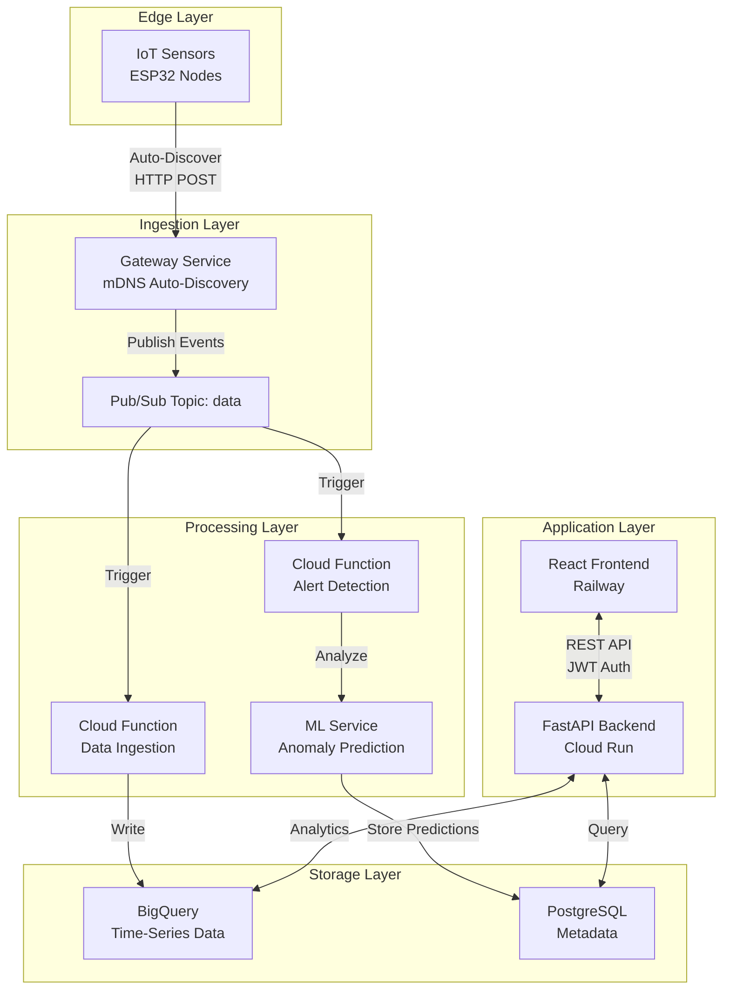

# Introduction to GreenCop

!!! warning "Educational Project Disclaimer"
    This is an educational project built to demonstrate IoT monitoring architecture, machine learning integration, and cloud-native development practices. Not intended for commercial use.

## What is GreenCop?

GreenCop is full-stack observability for physical infrastructure. Monitor server rooms, data centers, and critical hardware with real-time telemetry and predictive AI alerts.

Stop reacting to failures. Start preventing them.

## Why GreenCop Exists

A single server room outage costs businesses an average of **$5,600 per minute**. Traditional monitoring solutions only alert you when it's too late—after temperatures have spiked, after hardware has throttled, after your services have degraded.

GreenCop predicts problems **20 seconds before they happen** using machine learning anomaly detection. You get advance warning to take action before conditions become critical.

## Key Differentiators

### Predictive vs Reactive

Most monitoring tools alert you when thresholds are crossed. By then, damage may already be done.

GreenCop's ML-powered anomaly detection analyzes patterns in your sensor data and warns you about unusual behavior before it escalates. Temperature trending up faster than normal? You'll know before it hits your hard limit.

!!! tip
    Enable prediction feedback after your first week. Mark which alerts were actionable vs. false positives. The model retrains nightly and gets smarter with your specific infrastructure patterns.

### Zero-Configuration Deployment

No IP addresses to configure. No manual sensor registration. Power on an ESP32 sensor and it auto-discovers the gateway via mDNS (`greencop-gateway.local`), registers itself with a unique hardware ID, and starts streaming data.

**Setup time**: ~2 minutes per sensor.

### Dual-Layer Intelligence

Combine threshold-based alerts (immediate hardware risk) with ML anomaly detection (early warning system) for comprehensive coverage.

- **Hard Limits**: Temperature > 30°C → instant alert
- **ML Anomalies**: Unusual pattern detected → advance warning
- **Predictions**: Forecasted threshold breach in 20 seconds → preventive action window

!!! tip "Alert Strategy"
    Set hard limits 5°C above your comfort zone for true emergencies. Use ML alerts for everything else to reduce noise. Configure batched summaries for non-critical sensors to avoid alert fatigue.

## Who Should Use GreenCop?

### Data Center Operators
Monitor temperature and humidity across racks, prevent costly downtime, and maintain compliance logs for audits.

**Value**: Reduce MTTR by 60% with unified monitoring vs. siloed tools.

### IT Infrastructure Teams
Prevent hardware failures from environmental issues, reduce downtime, and sleep better knowing predictive alerts are watching 24/7.

**Value**: One prevented outage pays for the system for an entire year.

### DevOps Engineers
Integrate monitoring data into your existing workflow. Trigger automated HVAC adjustments, route alerts to different Teams channels based on sensor location, export compliance reports programmatically.

**Value**: Full REST API access. Build custom automations in hours, not weeks.

### IoT Students & Researchers
Learn cloud-native IoT architecture with real hardware, understand event-driven systems, practice with modern web technologies (React, FastAPI, Terraform).

**Value**: Portfolio-worthy project demonstrating end-to-end system design.

## How It Works

**Data Flow in 5 Steps**:

1. **Sensors** measure temperature/humidity every 30 seconds and auto-register via mDNS
2. **Gateway** receives data and publishes to Google Cloud Pub/Sub queue
3. **Cloud Functions** process events and store in BigQuery
4. **ML Service** analyzes patterns and generates predictions
5. **Dashboard** displays real-time metrics, alerts, and anomaly predictions

## System Components

### ESP32 Sensor Nodes (Edge)
- Low-cost WiFi microcontrollers ($5-10 each)
- MicroPython firmware for easy programming
- Auto-registration via mDNS (zero config!)
- LED status indicators (green: active, red: error)

!!! tip "Hardware Choice"
    Start with 2-3 ESP32 nodes to validate the system. Scale to hundreds once you've proven ROI. Sensors pay for themselves after preventing one hardware failure.

### Go Gateway Service (Local Bridge)
- High-performance local coordinator written in Go
- Broadcasts mDNS for sensor auto-discovery
- Routes data to Google Cloud Pub/Sub
- Monitors sensor health via heartbeats
- **Zero-config deployment**: Sensors find the gateway automatically

### Cloud Data Pipeline (Processing)
- **Pub/Sub**: Event streaming for real-time data flow
- **Cloud Functions**: Serverless processing for data ingestion and alerts
- **BigQuery**: Petabyte-scale time-series data warehouse
- **Cloud SQL**: PostgreSQL for customer metadata and configurations

### FastAPI Backend (Cloud Run)
- High-performance Python async API
- RESTful endpoints for all operations
- JWT authentication with bcrypt password hashing
- SQLAlchemy ORM with Alembic migrations
- Full BigQuery integration for analytics queries

### React Frontend (Railway)
- Modern TypeScript SPA with React 19
- Real-time dashboard updates
- Interactive Recharts visualizations
- Multi-language support (English/French)
- Responsive design for mobile/tablet/desktop

## Technology Stack Summary

**Frontend**: React 19, TypeScript, TailwindCSS, Recharts, Vite
**Backend**: FastAPI (Python), PostgreSQL, Cloud Run
**IoT Pipeline**: ESP32 (MicroPython), Go Gateway, Pub/Sub, Cloud Functions, BigQuery
**ML**: Scikit-learn Isolation Forest, Cloud Run ML service
**Infrastructure**: Terraform IaC, Docker, Google Cloud Platform

## Use Cases

### Data Center Monitoring
Monitor server room temperatures across multiple locations, receive alerts when cooling systems fail, and maintain compliance logs for SOC 2 / HIPAA audits.

**Customer Result**: "We caught a failing AC unit 15 minutes before critical threshold. Saved $45K in potential revenue loss." - IT Director, SaaS Company

### Laboratory Environments
Ensure research equipment operates within safe environmental ranges, track conditions over time for compliance, and document environmental data for grant reporting.

### Storage Facilities
Monitor temperature-sensitive storage (vaccines, electronics, food), prevent product damage from environmental drift, and maintain quality control records.

### Educational Projects
Learn cloud-native IoT architecture, practice with real hardware and modern web technologies, build a portfolio-worthy end-to-end system.

## Next Steps

!!! info "Choose Your Path"
    - **New User?** Start with the [Quick Start Guide](quick-start.md) to get running in 5 minutes
    - **Developer?** Check [Local Setup](../development/local-setup.md) for dev environment
    - **Hardware Fan?** Jump to [ESP32 Setup](../hardware/esp32-setup.md) to deploy sensors
    - **Architect?** Read [Architecture Deep Dive](architecture.md) for system design

Ready to explore features?

- [Dashboard Overview](../features/dashboard.md) - Unified monitoring interface
- [Alert System](../features/alerts.md) - Dual-layer intelligence
- [API Reference](../api-reference/overview.md) - Build custom integrations
