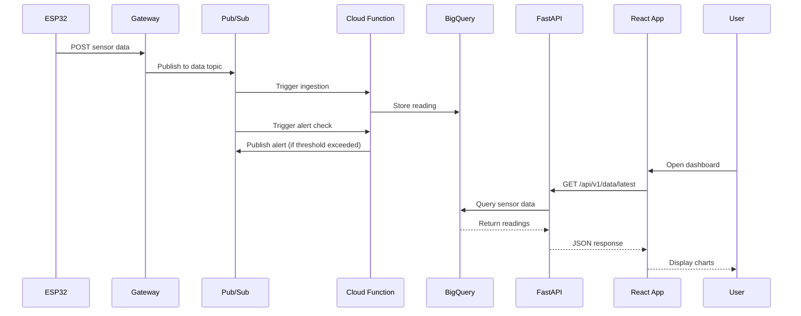

# Introduction to GreenCop

## What is GreenCop?

GreenCop is a comprehensive IoT monitoring system designed to track environmental conditions in server rooms, data centers, and other critical infrastructure. The system collects temperature and humidity data from distributed ESP32 sensor nodes, processes it through a cloud-native pipeline, and presents insights through an intuitive web dashboard.

## Why GreenCop?

### The Problem

Server rooms and data centers require constant environmental monitoring to prevent equipment damage from:

- Overheating that can damage expensive hardware
- High humidity causing condensation and electrical issues
- Low humidity increasing static electricity risks
- Lack of real-time visibility into environmental conditions

### The Solution

GreenCop provides:

1. **Real-Time Monitoring**: Continuous tracking of temperature and humidity
2. **Instant Alerts**: Immediate notifications when conditions exceed safe thresholds
3. **Historical Analysis**: Track trends over time to identify patterns
4. **Cost-Effective**: Built on affordable ESP32 hardware
5. **Cloud-Native**: Scalable architecture using Google Cloud Platform
6. **Easy Access**: Web-based dashboard accessible from anywhere

## Key Benefits

### For Facility Managers

- Monitor multiple server rooms from a single dashboard
- Receive instant alerts before problems occur
- Access historical data for compliance and reporting
- No complex installation or expensive equipment

### For IT Teams

- Prevent hardware failures from environmental issues
- Reduce downtime caused by temperature/humidity problems
- Integrate with existing systems via REST API
- Deploy additional sensors quickly and easily

### For Students & Researchers

- Learn cloud-native IoT architecture
- Understand event-driven systems
- Practice with modern web technologies
- Deploy real-world monitoring solutions

## System Components

### 1. ESP32 Sensor Nodes

- Low-cost WiFi-enabled microcontrollers
- MicroPython firmware for easy programming
- Autonomous operation with auto-registration
- LED indicators for status monitoring

### 2. Cloud Data Pipeline

- Google Cloud Pub/Sub for event streaming
- Cloud Functions for serverless processing
- BigQuery for scalable data warehouse
- Cloud SQL (PostgreSQL) for metadata

### 3. Go Gateway Service (Local Bridge)

- **Language**: Go
- **Purpose**: Local coordinator between sensors and cloud
- **Features**:
  - HTTP server on port 8080
  - mDNS broadcasting (`greencop-gateway.local`)
  - Auto-registers ESP32 sensors
  - Routes messages to Google Cloud Pub/Sub
  - Heartbeat monitoring for sensor health
- **Zero-Config**: Sensors auto-discover via mDNS

### 4. Backend API (Cloud)

- FastAPI framework for high performance
- RESTful endpoints for all operations
- JWT authentication for security
- SQLAlchemy ORM for database access
- BigQuery integration for analytics

### 5. Web Dashboard

- React frontend with TypeScript
- Real-time data updates
- Interactive charts and graphs
- Responsive design for mobile access

## How It Works

### Data Flow

### Event-Driven Architecture

GreenCop uses an event-driven architecture for scalability and reliability:

1. **Sensors publish events** when readings are taken
2. **Pub/Sub distributes events** to subscribers
3. **Cloud Functions process events** independently
4. **Data stored** in BigQuery and PostgreSQL
5. **API serves** aggregated data to frontend
6. **Users view** real-time and historical data

## Technology Stack

### Frontend

- **React 19.2.0**: Modern UI framework
- **TypeScript**: Type-safe development
- **Vite**: Fast build tool
- **TailwindCSS**: Utility-first styling
- **Recharts**: Data visualization
- **Axios**: HTTP client

### Gateway (Local Coordinator)

- **Go 1.21+**: High-performance compiled language
- **net/http**: Standard library HTTP server
- **hashicorp/mdns**: mDNS service discovery
- **go.uber.org/zap**: Structured logging
- **Google Cloud Pub/Sub SDK**: Message publishing

### Backend (Cloud API)

- **FastAPI**: High-performance Python framework
- **SQLAlchemy**: ORM for database access
- **Pydantic**: Data validation
- **JWT**: Token-based authentication
- **Bcrypt**: Password hashing
- **Alembic**: Database migrations

### Cloud Infrastructure

- **Google Cloud Pub/Sub**: Event streaming
- **Google Cloud Functions**: Serverless compute
- **BigQuery**: Data warehouse
- **Cloud SQL**: PostgreSQL database
- **Cloud Run**: Container orchestration
- **Terraform**: Infrastructure as Code

### Hardware

- **ESP32**: WiFi microcontroller
- **MicroPython**: Python for embedded systems
- **DHT Sensor**: Temperature/humidity measurement

## Use Cases

### Data Center Monitoring

Monitor server room temperatures across multiple locations, receive alerts when cooling systems fail, and maintain compliance logs.

### Laboratory Environments

Ensure research equipment operates within safe environmental ranges, track conditions over time, and document environmental data.

### Storage Facilities

Monitor temperature-sensitive storage areas, prevent product damage from environmental conditions, and maintain quality control records.

### Educational Projects

Learn IoT architecture, practice cloud development, understand event-driven systems, and build real-world applications.

## Project Goals

GreenCop was developed with these goals:

1. **Practical**: Solve real monitoring needs
2. **Educational**: Demonstrate modern IoT architecture
3. **Scalable**: Handle growth from 1 to 1000s of sensors
4. **Cost-Effective**: Use affordable hardware
5. **Open**: Available for learning and extension

## Next Steps

Ready to get started?

- [Quick Start Guide](quick-start.md) - Get GreenCop running in 5 minutes
- [Installation](installation.md) - Detailed setup instructions
- [Architecture](architecture.md) - Deep dive into system design

Want to understand features?

- [Features Overview](../features/dashboard.md) - Learn what GreenCop can do
- [User Guide](../user-guide/registration.md) - Step-by-step usage instructions
