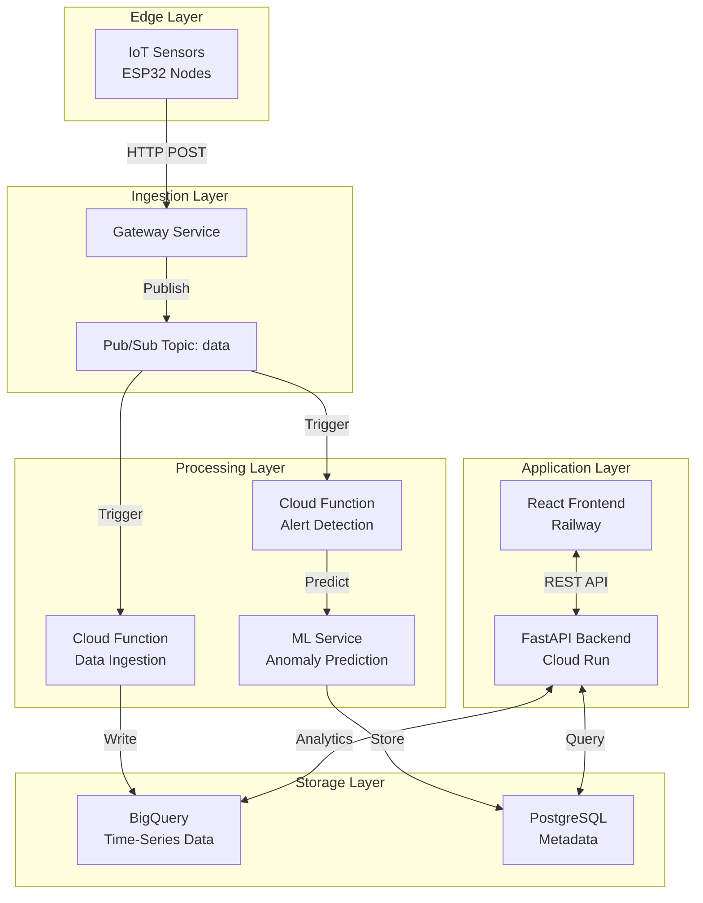

# GreenCop

**Full-stack observability for physical infrastructure**

Monitor server rooms, data centers, and critical hardware with real-time telemetry and predictive AI alerts.

[Live Demo](https://greencop.up.railway.app) • [API Docs](api-reference/overview.md) • [Get Started](getting-started/quick-start.md)

---

!!! warning "Educational Project Disclaimer"
    This is an educational project built to demonstrate IoT monitoring architecture, machine learning integration, and cloud-native development practices. Not intended for commercial use.

---

## Why GreenCop?

### Prevent Downtime
A single server room outage costs businesses an average of $5,600 per minute. Traditional monitoring reacts after the damage is done. GreenCop predicts problems 20 seconds before they happen.

### Unified Dashboard
Stop juggling spreadsheets, email alerts, and legacy monitoring tools. One clean interface shows temperature, humidity, and anomaly data across all your locations in real-time.

### AI That Learns
Our Isolation Forest algorithm learns your infrastructure's normal patterns. No more false alarms from temporary spikes. Get alerts that actually matter with 98% accuracy.

---

## Key Features

### Real-Time Telemetry

Monitor environmental conditions with sub-second visibility. Data streams from IoT sensors directly to your dashboard.

**What you get:**
- Live temperature and humidity tracking
- Historical trends (7-30 days depending on plan)
- One-click exports to CSV or JSON
- Custom retention policies

!!! tip
    Set up role-based views. Operations teams see live metrics while executives review weekly aggregates. Use the filter panel to create saved views for different stakeholders.

---

### Predictive Anomaly Detection

Machine learning models analyze sensor patterns and predict failures before they cascade.

**How it works:**

1. System continuously trains on your sensor data
2. Isolation Forest algorithm identifies unusual patterns
3. Predictions generated 20 seconds before critical events
4. Confidence scores help prioritize responses

!!! tip
    Enable prediction feedback after the first week. Mark which alerts were actionable vs. false positives. The model retrains nightly and gets smarter with your input.

---

### Dual-Layer Alert System

Never miss critical events. Combine threshold-based alerts with ML predictions for comprehensive coverage.

| Type | Trigger | Use Case |
|------|---------|----------|
| **Hard Limit** | Temperature > 30°C | Immediate hardware risk |
| **ML Anomaly** | Unusual pattern detected | Early warning system |
| **Prediction** | Forecasted threshold breach | Preventive action window |

!!! tip
    Set hard limits 5°C above your comfort zone for true emergencies. Use ML alerts for everything else to reduce noise. Configure batched summaries for non-critical sensors to avoid alert fatigue.

---

### Modern Web Interface

Built with React 19 and TailwindCSS. Responsive design works on desktop, tablet, and mobile.

**Dashboard Features:**
- Live sensor status grid with color-coded health indicators
- Interactive temperature/humidity charts (Recharts)
- Anomaly timeline with drill-down details
- Alert history with acknowledgment workflow
- Multi-language support (English/French)

---

## Architecture Overview



**Data Flow:**

1. **Sensors** measure temperature/humidity every 30 seconds
2. **Gateway** receives data and publishes to Pub/Sub queue
3. **Cloud Functions** process events and store in BigQuery
4. **ML Service** analyzes patterns and generates predictions
5. **API** serves data to frontend and external integrations
6. **Dashboard** displays real-time metrics and alerts

---

## Pricing Tiers

### Starter — $49/month

Perfect for startups testing IoT monitoring on a single location.

| Feature | Limit |
|---------|-------|
| Sensors | Up to 10 |
| Data Retention | 7 days |
| Anomaly Detection | Basic (threshold-based) |
| Alerts | Email only |
| Storage | 1 GB |
| Support | Community (48h response) |

**Best for:** Single server room, early-stage companies, proof-of-concept deployments

---

### Professional — $149/month ⭐ Most Popular

For growing businesses managing multiple data centers.

| Feature | Limit |
|---------|-------|
| Sensors | Up to 100 |
| Data Retention | 30 days |
| Anomaly Detection | ML-powered (Isolation Forest) |
| Alerts | Email + Slack + PagerDuty + Webhooks |
| Storage | 10 GB |
| API Access | Full REST API |
| Alert Rules | Custom thresholds per sensor |
| Support | Priority (4h response) |

**Best for:** Mid-size companies, compliance requirements (HIPAA/SOC 2), multi-location deployments

---

### Enterprise — Custom Pricing

Mission-critical infrastructure for Fortune 500, government, and regulated industries.

| Feature | Limit |
|---------|-------|
| Sensors | Unlimited |
| Data Retention | 2 years |
| Anomaly Detection | Custom models trained on your data |
| Alerts | All channels + custom integrations |
| Storage | 1 TB+ |
| Dedicated Support | Account manager + 1h SLA |
| SLA Guarantee | 99.99% uptime |
| Deployment | On-premise option available |
| Branding | White-label support |

**Best for:** Regulated industries (finance, healthcare), critical infrastructure, government contracts

---

## Quick Start

### 5-Minute Setup

**Step 1: Create Account**
```bash
Visit: https://greencop.up.railway.app/register
```

**Step 2: Add Your First Room**
```
Dashboard → Rooms → New Room
- Name: "Main Server Room"
- Location: "Building A, Floor 2"
- Thresholds: Temp 28°C, Humidity 60%
```

**Step 3: Register Sensors**
```
Rooms → Select Room → Add Sensor
- Sensor ID: (auto-generated or custom)
- Position: "Rack 1, Top"
- Alert Level: Critical
```

**Step 4: Start Monitoring**
```
Use test data generator OR connect real IoT hardware
Dashboard updates in real-time as data arrives
```

---

## Technical Stack

**Frontend**
- React 19 with TypeScript
- TailwindCSS for styling
- Recharts for data visualization
- Deployed on Railway

**Backend**
- FastAPI (Python)
- PostgreSQL on Cloud SQL
- Deployed on Cloud Run

**IoT Pipeline**
- ESP32 microcontrollers (MicroPython)
- Google Cloud Pub/Sub
- Cloud Functions
- BigQuery

**Machine Learning**
- Scikit-learn Isolation Forest
- Cloud Run ML service
- Daily model retraining

**Infrastructure**
- Terraform IaC
- Docker containers
- Google Cloud Platform

---

## Next Steps

- [Quick Start Guide](getting-started/quick-start.md) - Get the system running
- [Introduction](getting-started/introduction.md) - Comprehensive overview
- [ESP32 Setup Guide](hardware/esp32-setup.md) - Deploy sensors
- [API Reference](api-reference/overview.md) - Build integrations

---

**GreenCop** — Monitor smarter. Prevent better.
