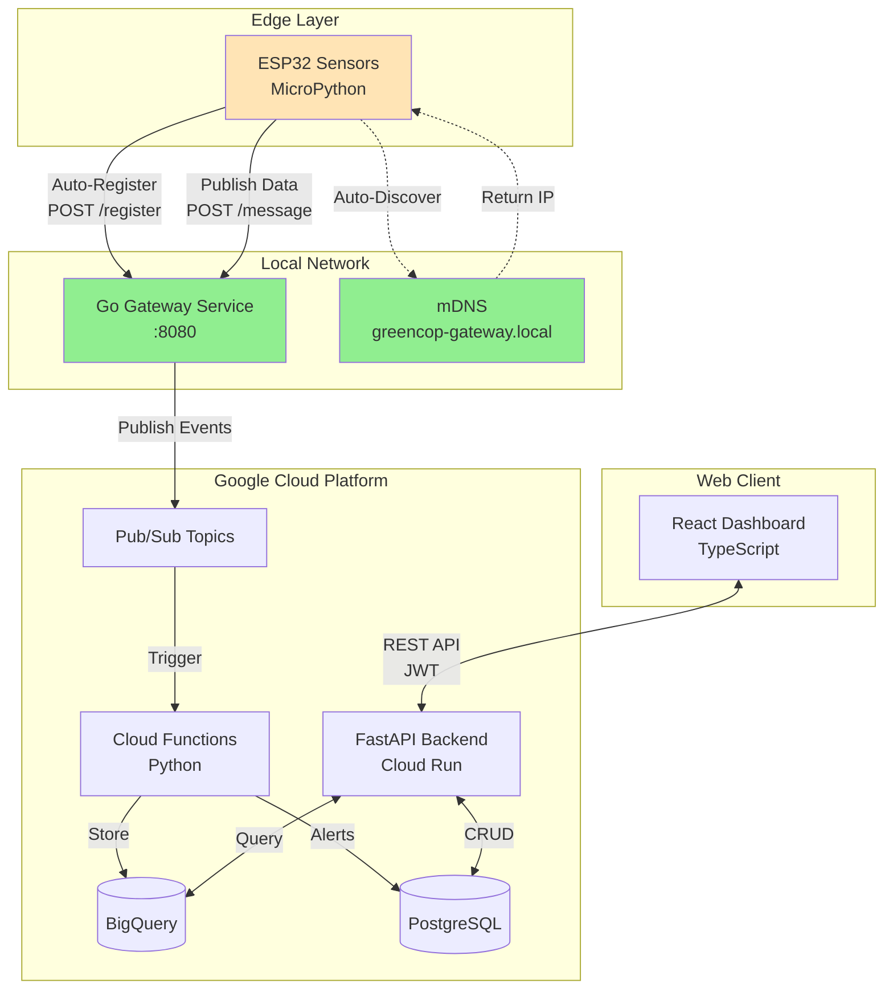

# Welcome to GreenCop

**GreenCop** is an IoT sensor monitoring system designed to track environmental conditions (temperature and humidity) in server rooms and critical infrastructure. Built on Google Cloud Platform with modern cloud-native architecture, GreenCop provides real-time monitoring, intelligent alerts, and comprehensive data analytics.

## Key Features

### 🌐 Zero-Configuration Deployment

**Auto-Discovery via mDNS**: ESP32 sensors automatically find the Go gateway service using `greencop-gateway.local` - no IP addresses to configure!

**Automatic Registration**: Power on an ESP32 sensor and it registers itself with its unique hardware ID - completely plug-and-play.

### 🔧 Distributed Mini System

**Go Gateway Service**: Local coordinator written in Go that bridges sensors to the cloud with mDNS broadcasting and efficient message routing.

**Event-Driven Architecture**: Sensor data flows through Pub/Sub to Cloud Functions for processing, enabling scalable real-time monitoring.

### 📊 Monitoring & Analytics

**Real-Time Monitoring**: Track temperature and humidity sensors with automatic polling and live dashboard updates.

**Intelligent Alerts**: Configure custom thresholds and receive instant alerts when environmental conditions exceed safe limits.

**Data Analytics**: Visualize historical trends, view statistics, and analyze sensor data over multiple time periods with interactive charts.

### 🏢 Management & Integration

**Server Room Management**: Organize sensors by physical locations or logical groups for better organization and monitoring.

**REST API**: Full-featured REST APIs (FastAPI + Go Gateway) with JWT authentication for integration with other systems.

**ESP32 Sensors**: Deploy low-cost ESP32 microcontrollers running MicroPython as autonomous edge sensor nodes.

## System Overview

GreenCop follows a **distributed, event-driven architecture** with zero-configuration deployment:

**Key Highlights**:

- 🔍 **mDNS Auto-Discovery**: Sensors find gateway automatically
- 🤖 **Auto-Registration**: No manual sensor configuration needed
- 🔧 **Go Gateway**: High-performance local coordinator
- ☁️ **Cloud Processing**: Serverless event processing
- 📊 **Dual Storage**: BigQuery for analytics, PostgreSQL for metadata

## Quick Links

[Getting Started](getting-started/quick-start.md){ .md-button .md-button--primary }
[API Reference](api-reference/overview.md){ .md-button }
[Hardware Setup](hardware/esp32-setup.md){ .md-button }
[User Guide](user-guide/registration.md){ .md-button }

## System Requirements

### For Running the System

- **Docker** and **Docker Compose** (for local development)
- **Google Cloud Platform** account (for production deployment)
- **PostgreSQL** database
- Internet connection for cloud services

### For ESP32 Sensors

- ESP32 development board
- Temperature/Humidity sensor (DHT11 or DHT22)
- MicroPython firmware
- WiFi network access

## Architecture Highlights

- **Event-Driven**: Uses Google Cloud Pub/Sub for real-time event streaming
- **Serverless**: Cloud Functions for data processing and alert detection
- **Scalable**: BigQuery for data warehouse, Cloud SQL for metadata
- **Modern Stack**: FastAPI backend, React frontend
- **Infrastructure as Code**: Terraform for GCP resource management

## Use Cases

- **Data Center Monitoring**: Monitor temperature in server rooms
- **Laboratory Environments**: Track environmental conditions
- **Storage Facilities**: Ensure optimal storage conditions
- **IoT Education**: Learn cloud-native IoT architecture

## Support

For issues, questions, or contributions:

- GitHub Repository: [ahmedennaifer/greencop](https://github.com/ahmedennaifer/greencop)
- Documentation: You're reading it!
- Issues: [GitHub Issues](https://github.com/ahmedennaifer/greencop/issues)

## Next Steps

New to GreenCop? Start with our [Quick Start Guide](getting-started/quick-start.md) to get the system running in minutes.

Want to understand the system better? Read the [Introduction](getting-started/introduction.md) for a comprehensive overview.

Ready to deploy sensors? Check out the [ESP32 Setup Guide](hardware/esp32-setup.md).

## Auto-Registration with mDNS

One of GreenCop's key features is **zero-configuration sensor deployment**:

1. **Flash ESP32** with MicroPython firmware
2. **Configure WiFi** credentials
3. **Power on sensor** - that's it!

The sensor automatically:
- Discovers the Go gateway via mDNS (`greencop-gateway.local`)
- Registers itself with unique hardware ID
- Starts publishing temperature/humidity data
- No manual configuration needed!

## Go Gateway Service

The **local Go gateway** acts as a bridge between your sensors and the cloud:

- Written in **Go** for performance and concurrency
- Broadcasts mDNS for auto-discovery
- Manages sensor registration
- Routes data to Google Cloud Pub/Sub
- Monitors sensor health via heartbeats

**Zero-config deployment**: Sensors find the gateway automatically!
