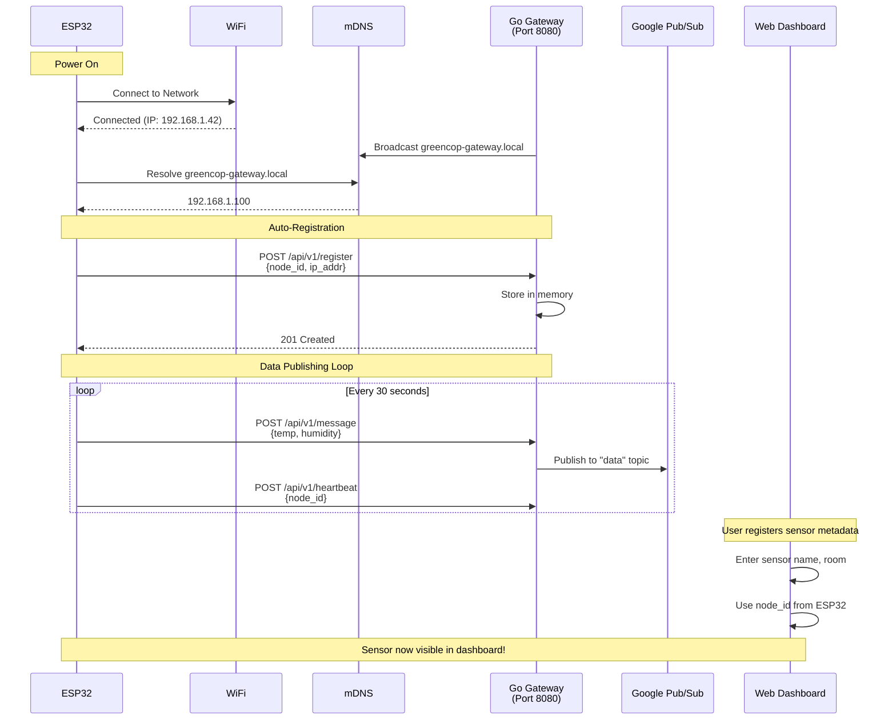

# Managing Sensors

Complete guide to registering, configuring, and maintaining ESP32 sensor nodes.

## Sensor Lifecycle

1. **Purchase Hardware**: ESP32 + DHT sensor
2. **Flash Firmware**: Install MicroPython + GreenCop code
3. **Configure**: Set WiFi and gateway URL
4. **Register in System**: Add to GreenCop web interface
5. **Deploy**: Mount in server room
6. **Monitor**: View data on dashboard
7. **Maintain**: Check health, replace if needed

## Adding a New Sensor

### Prerequisites

- At least one server room created
- ESP32 hardware configured and online
- Sensor publishing data to gateway
- Know the sensor's unique ID (node_id)

### Registration Steps

1. Navigate to **Sensors** page in sidebar
2. Click **New Sensor** button (top right)
3. Fill in registration form:
   - **Sensor ID**: The ESP32's unique hardware ID (e.g., `20e7c89f14ec`)
   - **Sensor Name**: Human-readable name (e.g., "Rack 1 Temp Sensor")
   - **Sensor Type**: Default is "ESP32" (can customize)
   - **Server Room**: Select from dropdown
4. Click **Register Sensor**
5. Sensor appears in grid immediately

### Finding Sensor ID

**From ESP32 Serial Output**:
```python
import machine
print(machine.unique_id())
# Outputs something like: b' \xe7\xc8\x9f\x14\xec'
```

**From Gateway Logs**:
- Check gateway logs for registration attempts
- ID appears in POST requests

## Viewing Sensors

### Sensors Page

**Grid View**:
- All sensors across all rooms
- Grouped by room
- Real-time data display
- Auto-refreshes every 10 seconds

**Information Shown**:
- Sensor name and room
- Current temperature (orange card)
- Current humidity (blue card)
- Last update timestamp
- Delete button

### Sensor Detail Page

Click any sensor card to see:
- Large current temperature reading
- Large current humidity reading
- Time range selector (1h/24h/7d)
- Temperature history chart
- Humidity history chart
- Back to sensors button

## Updating Sensors

!!! note
    UI for updating sensors is planned for future releases.

**Current Method**: API only

```bash
PUT /api/v1/sensors/update_sensor/{sensor_id}
{
  "name": "New Sensor Name",
  "type": "ESP32-Updated",
  "room_id": 2
}
```

## Deleting Sensors

### From Sensors Page

1. Find the sensor card
2. Click trash icon (red) in top-right corner
3. Confirm deletion in browser dialog
4. Sensor removed immediately

**Effects**:
- Sensor removed from database
- Historical data PRESERVED in BigQuery
- Future readings from this sensor ID ignored

**Warning**: Cannot be undone!

### When to Delete

- Sensor permanently decommissioned
- Sensor replaced with different hardware
- Test sensors no longer needed
- Duplicate registrations

## Sensor Status

### Online/Reporting

**Indicators**:
- Recent timestamp (< 1 minute old)
- Data appears on dashboard
- Charts update regularly
- Green LED blinking on ESP32

### Offline/Not Reporting

**Indicators**:
- Old timestamp (> 5 minutes)
- "No data available" on card
- Charts empty or stale
- No LED activity on ESP32

**Troubleshooting Steps**:
1. Check ESP32 power
2. Verify WiFi connection
3. Confirm gateway is reachable
4. Review ESP32 serial output for errors
5. Check gateway logs

## Best Practices

### Naming

Good sensor names:
- "Rack 1 - Top Shelf"
- "HVAC Intake Sensor"
- "DC1-R03-T1" (data center, rack, position)

Avoid:
- "Sensor 1" (not descriptive)
- Very long names (breaks UI)
- Special characters

### Organization

- Group related sensors in same room
- Use consistent naming scheme
- Document sensor locations physically
- Keep spare sensors for quick replacement

### Maintenance

- Check sensor list weekly
- Remove decommissioned sensors
- Verify all sensors reporting
- Replace sensors with erratic readings

## Bulk Operations

!!! note "Future Feature"
    Bulk import/export of sensors planned

**Workaround**: Use API to script sensor registration

```python
import requests

sensors = [
    {"id": "sensor001", "name": "Rack 1", "room_id": 1},
    {"id": "sensor002", "name": "Rack 2", "room_id": 1},
]

for sensor in sensors:
    requests.post("http://localhost:8080/api/v1/sensors/new_sensor", json=sensor)
```

## Troubleshooting

### Can't Register Sensor

**Error**: "All fields are required"
- Fill in all form fields
- Ensure room is selected

**Error**: "Sensor already exists"
- Sensor ID already registered
- Delete old registration or use different ID

### Sensor Not Showing Data

**Symptoms**: Card shows "No data available"

**Solutions**:
1. Wait 30 seconds for first reading
2. Check ESP32 is publishing (serial monitor)
3. Verify gateway receiving messages
4. Confirm BigQuery ingestion working
5. Check sensor ID matches registration

### Wrong Room Assignment

**Solution**: Delete and re-register sensor (or use update API)

## Next Steps

- [View Sensor Data](viewing-data.md)
- [Configure Alerts](configuring-alerts.md)
- [ESP32 Hardware Setup](../hardware/esp32-setup.md)
- [Sensors API Reference](../api-reference/sensors.md)

## Auto-Registration Architecture



**Key Points**:
- ESP32 auto-discovers gateway via mDNS
- Registration happens automatically on power-on
- User only needs to add metadata in web UI
- Data flows immediately after registration
